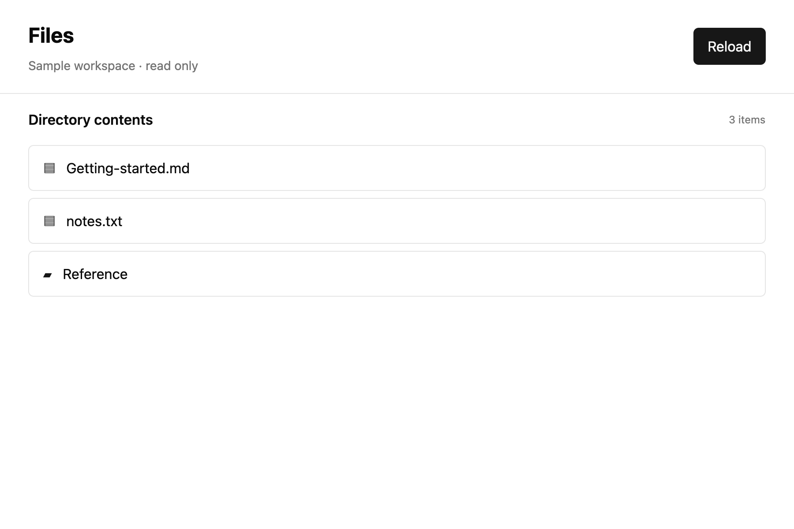

# Return async results to an entity

## What you'll build

Start a directory read, show Loading, and apply the result only while the view and request are current. Run `cargo run -p mkit-example-async-file-browser --locked` from the workspace root.



## Concept

An *entity* owns the browser's retained state. [`Context<T>::spawn`](https://github.com/zed-industries/zed/blob/d89e9c2124b2786a390c7a451c7488601b4da2e1/crates/gpui/src/app/context.rs#L236-L250) gives its async continuation a [`WeakEntity<T>`](https://github.com/zed-industries/zed/blob/d89e9c2124b2786a390c7a451c7488601b4da2e1/crates/gpui/src/app/entity_map.rs#L740-L785) and `&mut AsyncApp`. The weak handle does not keep the view alive. `WeakEntity::update` applies a short foreground mutation if the view still exists, or returns an error after it is released. A visible state change calls [`Context::notify`](https://github.com/zed-industries/zed/blob/d89e9c2124b2786a390c7a451c7488601b4da2e1/crates/gpui/src/app/context.rs#L230-L233).

## Minimal compiling example

This source comes from the compiling `examples/async_file_browser/src/lib.rs`.

```rust
{{#include ../../../examples/async_file_browser/src/lib.rs:file_browser_load}}
```

Run `cargo test -p mkit-example-async-file-browser --lib --locked` for actual load, released-view, and out-of-order result tests. Run `cargo test -p mkit-example-async-file-browser --test screenshot --locked` for the macOS loading, loaded, and error baselines at 1800 × 1200 and scale 2.0. The image above is a controlled render state; the library test proves the background result reaches the entity.

## How it works

`reload` copies the directory path and in-memory settings into a background task. `begin_request` increments a generation number, clears old entries, sets Loading, and notifies the view. The foreground continuation awaits owned data, then attempts a weak update. If the view was released, it reports `Released`; if a newer generation exists, it reports `Stale`; otherwise it applies Loaded, Empty, or Error, calls `notify`, and reports `Applied`. Separate tests force a released view and finish the newer request before the older one. Neither can replace the newer visible result.

## Common mistakes

**Capturing a mutable GPUI context across background work.** [Official Zed discussion #41041](https://github.com/zed-industries/zed/discussions/41041) reports a borrow problem while starting async global initialization. That example is not this file browser. Send an owned path and settings into background work; return through `Context::spawn` and `WeakEntity::update` rather than carrying a mutable borrow across `await`.

## Exercises

Run the out-of-order test with three requests and complete the oldest last. The newest path and entries should remain visible. Drop the only strong view handle before completion and assert `LoadDelivery::Released`.

## API reference links

- [`Context::spawn`, `AppContext::background_spawn`, `WeakEntity::update`, `AsyncApp`, and `Context::notify`](../appendices/api-inventory.md) · [pinned context source](https://github.com/zed-industries/zed/blob/d89e9c2124b2786a390c7a451c7488601b4da2e1/crates/gpui/src/app/context.rs#L230-L255) · [background-spawn trait](https://github.com/zed-industries/zed/blob/d89e9c2124b2786a390c7a451c7488601b4da2e1/crates/gpui/src/gpui.rs#L237-L243)
