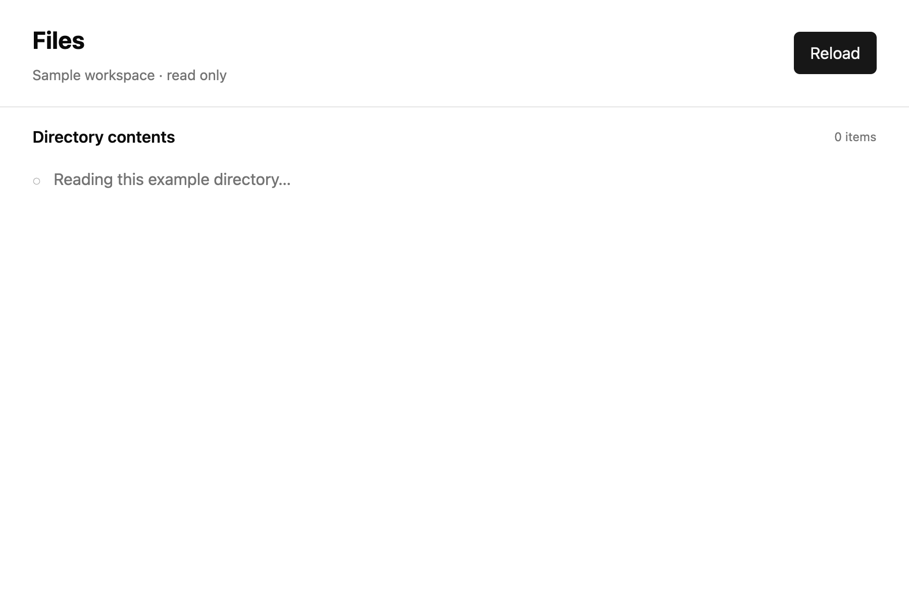

# Keep long work off the UI thread

## What you'll build

Run a read-only file browser whose directory scan leaves the window responsive. Run `cargo run -p mkit-example-async-file-browser --locked` from the workspace root.



## Concept

An *executor* polls a future, which is work that can pause and resume. GPUI's [`ForegroundExecutor`](https://github.com/zed-industries/zed/blob/d89e9c2124b2786a390c7a451c7488601b4da2e1/crates/gpui/src/executor.rs#L345-L365) runs on the UI thread. Its [`BackgroundExecutor`](https://github.com/zed-industries/zed/blob/d89e9c2124b2786a390c7a451c7488601b4da2e1/crates/gpui/src/executor.rs#L103-L123) runs owned, `Send` work away from that thread. An `async` block alone does not move a blocking directory read to the background. Both spawn methods return a [`Task<T>`](https://github.com/zed-industries/zed/blob/d89e9c2124b2786a390c7a451c7488601b4da2e1/crates/scheduler/src/executor.rs#L375-L386): keep or await it when its result matters, drop it to cancel pending work, or call `detach` to let it finish without its result.

## Minimal compiling example

These helpers come from the compiling `examples/async_file_browser/src/lib.rs`.

```rust
{{#include ../../../examples/async_file_browser/src/lib.rs:executors_and_tasks}}
```

Run `cargo test -p mkit-example-async-file-browser --lib --locked` for the foreground, background, cancellation, detach, and timer assertions. Run `cargo test -p mkit-example-async-file-browser --test screenshot --locked` for the macOS baselines at 1800 × 1200 and scale 2.0. The image above captures a controlled loading state; the library test checks the actual async load.

## How it works

`foreground_example` and `background_example` show the two executor choices. `example_timer` returns a task that becomes ready after the requested delay. The test confirms both executors run, drops a background task while it waits on a channel and checks that its completion effect does not happen, detaches another task and checks its effect, then advances GPUI's test clock by five seconds to complete the timer. The file browser's `reload` calls `AppContext::background_spawn` through its view context for the directory read and returns through a foreground continuation. A timer is not a precise real-world deadline.

## Common mistakes

**Trying to use the UI context inside background work.** [Official Zed discussion #41041](https://github.com/zed-industries/zed/discussions/41041) shows a beginner capturing `cx` in a background task while initializing a global; the borrow fails, and a reply points to `cx.spawn`. The report concerns a different app and revision. Move owned input to the background task, then use a foreground GPUI context to apply its result.

## Exercises

Change the test timer to ten seconds. Advance the test clock by five, assert it is pending, then advance five more and assert it is ready. Keep the task handle until the final assertion.

## API reference links

- [`ForegroundExecutor`, `BackgroundExecutor`, `Task`, and `AppContext::background_spawn`](../appendices/api-inventory.md) · [pinned executor source](https://github.com/zed-industries/zed/blob/d89e9c2124b2786a390c7a451c7488601b4da2e1/crates/gpui/src/executor.rs#L103-L189) · [background-spawn trait](https://github.com/zed-industries/zed/blob/d89e9c2124b2786a390c7a451c7488601b4da2e1/crates/gpui/src/gpui.rs#L237-L243)
