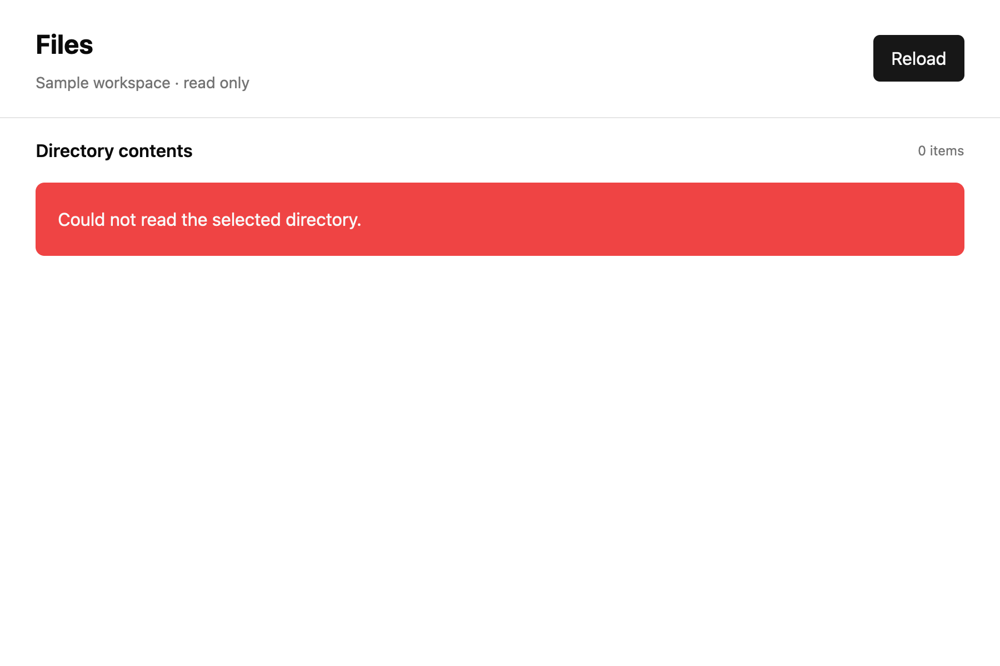

# Build an async file browser

## What you'll build

A read-only browser for a small fixture directory. It shows Loading, then sorted files and folders, an empty message, or an error. Run `cargo run -p mkit-example-async-file-browser --locked` from the workspace root; it opens the bundled `fixtures/sample` directory.




## Concept

The browser is a retained [`Render`](https://github.com/zed-industries/zed/blob/d89e9c2124b2786a390c7a451c7488601b4da2e1/crates/gpui/src/element.rs#L163-L178) view. Its entity holds a status and entry list. [`AppContext::background_spawn`](https://github.com/zed-industries/zed/blob/d89e9c2124b2786a390c7a451c7488601b4da2e1/crates/gpui/src/gpui.rs#L237-L243), called through the view context, runs the blocking directory read away from the UI; `Context::spawn` receives the result and updates the view through a weak handle. Directory access uses Rust's [`std::fs::read_dir`](https://doc.rust-lang.org/std/fs/fn.read_dir.html), not a GPUI file service. Its order is unspecified, so the adapter sorts names for stable output.

## Minimal compiling example

These anchored regions come from the compiling browser crate.

```rust
{{#include ../../../examples/async_file_browser/src/lib.rs:file_browser_state}}
```

```rust
{{#include ../../../examples/async_file_browser/src/lib.rs:file_browser_fs}}
```

```rust
{{#include ../../../examples/async_file_browser/src/lib.rs:file_browser_load}}
```

```rust
{{#include ../../../examples/async_file_browser/src/lib.rs:file_browser_view}}
```

```rust
{{#include ../../../examples/async_file_browser/src/main.rs:file_browser_main}}
```

Run `cargo test -p mkit-example-async-file-browser --lib --locked` for sorted, hidden, empty, missing, stale, and released cases. Run `cargo test -p mkit-example-async-file-browser --test screenshot --locked` for three macOS baselines at 1800 × 1200 and scale 2.0. Those screenshots set controlled view states for visual checks; the library tests run the actual background load. The pinned headless renderer reports unsupported capture on other platforms.

## How it works

`main` installs the theme and in-memory settings, opens a view rooted at the bundled sample, and starts `reload`. The view renders Loading without waiting for I/O. `read_directory` collects entries, hides dotfiles by default, skips symlinks, and sorts names. Its result returns through a weak view update. A generation check prevents an older request from replacing a newer one. The view renders Loaded, Empty, or Error according to the result; Reload starts another request. Tests use temporary directories and controlled completion order, not a developer's home directory. The UI is read-only; it does not offer navigation outside the chosen root.

## Common mistakes

**Blocking the UI while scanning a directory.** [Official Zed discussion #41041](https://github.com/zed-industries/zed/discussions/41041) shows a related mistake: trying to perform async work while carrying a GPUI context into background execution. Its example is global initialization, not file listing. Pass an owned path to background work and apply only the result through the foreground weak update. Also sort `read_dir` output; Rust does not promise entry order.

## Exercises

Add two files whose creation order differs from lexical order to a temporary test directory. Verify the displayed names are sorted. Point a test at an empty directory and confirm `BrowserStatus::Empty`; point it at a missing directory and confirm `BrowserStatus::Error`.

## API reference links

- [`Render`, `Context::spawn`, `AppContext::background_spawn`, `WeakEntity`, `Task`, and `Global`](../appendices/api-inventory.md) · [pinned context source](https://github.com/zed-industries/zed/blob/d89e9c2124b2786a390c7a451c7488601b4da2e1/crates/gpui/src/app/context.rs#L230-L255) · [background-spawn trait](https://github.com/zed-industries/zed/blob/d89e9c2124b2786a390c7a451c7488601b4da2e1/crates/gpui/src/gpui.rs#L237-L243)
- [Rust `std::fs::read_dir`](https://doc.rust-lang.org/std/fs/fn.read_dir.html)
