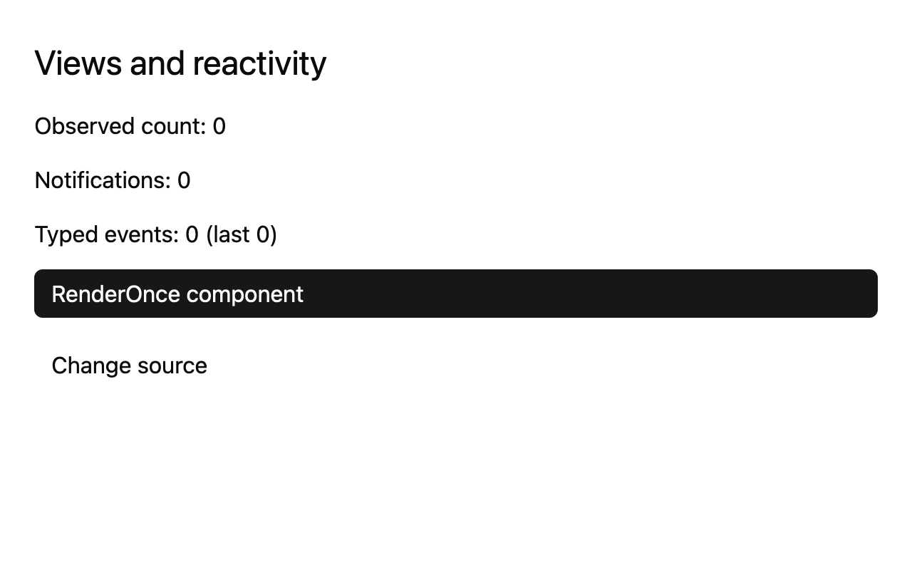

# Coming from React

## What you'll build

Run a small GPUI view that owns a source count, observes its changes, and receives a typed event. Click **Change source** and compare the three displayed counts. Run `cargo run -p mkit-example-reactivity-views` from the workspace root.



## Concept

In [React](https://react.dev/reference/react/useState), a component's state survives renders, and a state update asks React to show a new result. In GPUI, an [entity](../appendices/api-inventory.md) is a retained handle to Rust state. A view implements [`Render`](../appendices/api-inventory.md) to describe elements from that state. Updating an entity and calling `cx.notify()` tells GPUI the view needs to be refreshed. The pinned [view cache](https://github.com/zed-industries/zed/blob/d89e9c2124b2786a390c7a451c7488601b4da2e1/crates/gpui/src/view.rs#L380-L415) can reuse unchanged work, so this is not a promise that every view renders every frame.

React's [Effect](https://react.dev/reference/react/useEffect) synchronizes a component with an external system after a commit and uses a dependency list and cleanup function. GPUI's [`observe`](https://github.com/zed-industries/zed/blob/d89e9c2124b2786a390c7a451c7488601b4da2e1/crates/gpui/src/app/context.rs#L60-L82) listens for an entity's change notification; [`subscribe`](https://github.com/zed-industries/zed/blob/d89e9c2124b2786a390c7a451c7488601b4da2e1/crates/gpui/src/app/context.rs#L100-L123) listens for a typed event. Their returned `Subscription` handles must be retained. These are different contracts from React Effects.

## Minimal compiling example

```rust
{{#include ../../../examples/reactivity_views/src/lib.rs:reactivity_views_events}}
```

```rust
{{#include ../../../examples/reactivity_views/src/lib.rs:reactivity_views_view}}
```

```rust
{{#include ../../../examples/reactivity_views/src/main.rs:reactivity_views_main}}
```

Run `cargo test -p mkit-example-reactivity-views --locked`. Its library test clicks the source and checks both the retained values and rendered count. On macOS, its screenshot test compares the initial 1280 × 800, scale-2 image above. The headless pixel renderer is unavailable on Windows and Linux in this pin.

## How it works

`Source` owns the count. `ReactivityDemo` keeps its `Entity<Source>` and both subscription handles across renders. A click updates the source, emits `CountChanged`, and calls `cx.notify()`. The observer reads the new count after notification. The subscriber receives `CountChanged.count` directly. Each callback updates the root view and notifies it so its labels refresh. See the [reactivity chapter](../state/reactivity.md) for the tested path.

For a React reader, `Source` resembles state held outside a single component, but GPUI does not provide React hooks or a dependency array here. Choose the owner of each entity, retain subscriptions for the needed lifetime, and keep rendering code focused on describing the view.

## Common mistakes

**Changing an entity without notifying.** The field changes, but observers and the view can remain stale. Call `cx.notify()` after a change that should be shown. An [official Zed discussion about automatic notification](https://github.com/zed-industries/zed/discussions/45246) proposes removing this explicit step; it is not the pinned behavior. The pinned [`Context::notify`](https://github.com/zed-industries/zed/blob/d89e9c2124b2786a390c7a451c7488601b4da2e1/crates/gpui/src/app/context.rs#L228-L232) provides the correction.

## Exercises

Remove the typed event emission temporarily and click once. The observed count should change while the event count stays zero. Restore it, then remove the source notification and compare the counts again. Restore both calls before rerunning the test.

## API reference links

- [`Entity`, `Context`, `Render`, `EventEmitter`, and `Subscription`](../appendices/api-inventory.md) — retained state, view description, and callback lifetime.
