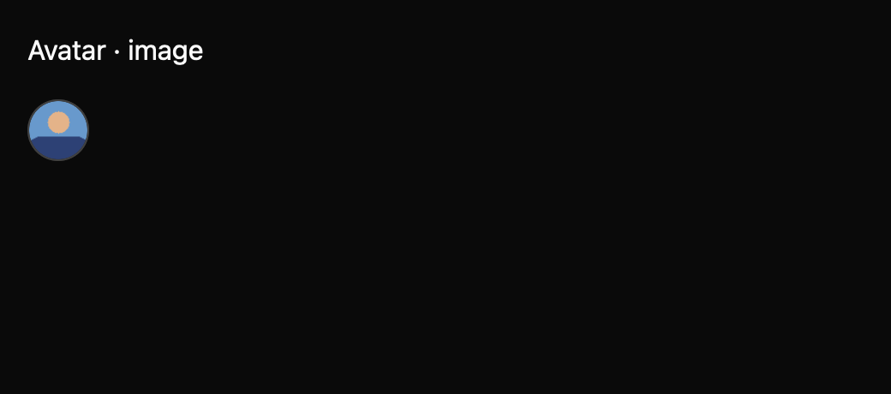

# Avatar

Avatar accepts an app-provided image source and uses app-provided initials when no image is given. It does not fetch images or generate initials from names. Small, medium, and large sizes use theme control tokens.

The draft registry contract is in `registry/avatar/spec.md`. The screenshot matrix spans declared states, three themes, and two scales. Image accessibility semantics and public API review remain pending.
