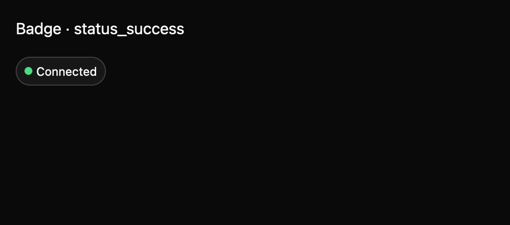

# Badge

Badge shows a compact count or a status dot with a visible text label. Counts default to a `99+` cap; apps can provide their own overflow label and accessible name. Status meaning does not rely on color alone.

The draft registry contract is in `registry/badge/spec.md`. The screenshot matrix spans declared states, three themes, and two scales. Public API review and native accessibility snapshots remain pending.
