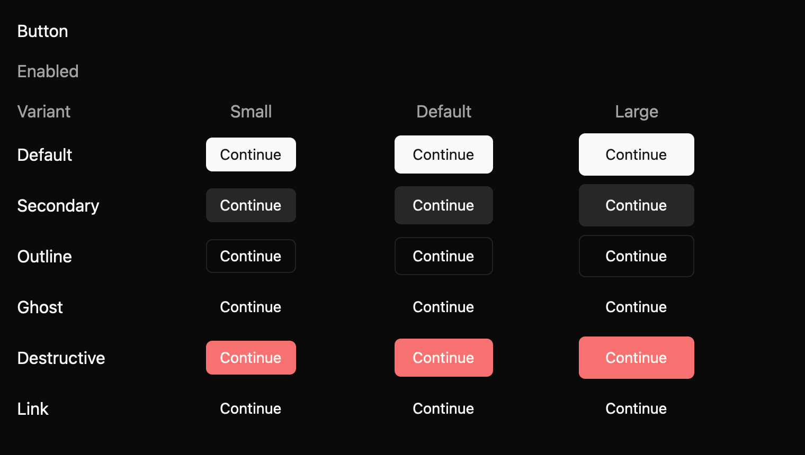

# Button

Trigger a command such as saving or submitting. This everyday component is a draft with an `implementation_in_progress` registry entry. Its public contract needs maintainer review.

*Dark theme, 2× baseline capture: `idle` state.*

## API and state

`Button::new(label)` is a stateless `RenderOnce` builder. Choose variant, size, optional leading/trailing element, disabled, loading, and accessible label. `on_activate` runs for primary click or keyboard activation. `on_click` runs only for a primary click, before `on_activate` when both exist. Disabled and loading suppress both.

## Keyboard behavior

The component's named actions can be rebound by the host where applicable.

| Key or action | Current behavior |
| --- | --- |
| Enter, Space | Activate when enabled and focused; disabled and loading do nothing. |

## Accessibility

Requests button role. Visible text supplies the name unless `aria_label` overrides it. Disabled and loading leave Tab order and request disabled state, with “Unavailable” or “Loading” descriptions. Busy-state announcement is unverified.

## Theme tokens

Buttons follow the shadcn/ui look. Default is an accent fill, secondary a muted mix of text over background, outline a background fill with a light border, ghost and link are transparent, and destructive uses the danger colour. Filled and outline buttons carry a small shadow. Hover darkens or tints the fill, and links underline on hover. Heights are 32, 36, and 40px (`controls.small`, `controls.medium`, `controls.large`), with 12, 16, and 24px padding, `radii.medium` corners, and 14px medium-weight labels. Disabled and loading buttons render at 50% opacity. Keyboard focus adds a focus-coloured border and a 3px ring. The high-contrast theme keeps solid accent, danger, and white-bordered variants, and shows unavailable buttons in the `disabled` colour. The spec's theme table lists each token mapping.

## Usage scenarios

- Save changes in a settings form; handle `on_activate` to persist the form.
- Submit a checkout step with loading enabled while the request runs.
- Offer a destructive Delete action using the destructive variant and an explicit confirmation flow.

## Verification and limits

Enter/Space adapter cases and focused pointer tests passed. 18/18 declared screenshot comparisons passed. Generated accessibility cases are pending. These are focused draft checks, not release approval. The full conformance matrix and maintainer review are outstanding. The current contract and evidence are in `registry/button/spec.md` and `docs/E7_AUDIT.md` in the repository.
