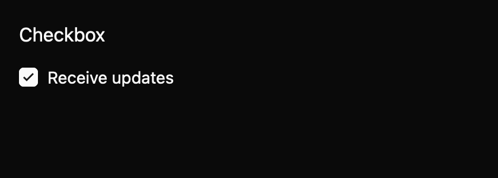

# Checkbox

Represent one labelled choice, including a mixed aggregate state. This everyday component is a draft with an `implementation_in_progress` registry entry. Its public contract needs maintainer review.

*Dark theme, 2× baseline capture: `checked` state.*

## API and state

`Checkbox::new(label, default_checked)` owns state. `controlled(label, checked)` emits `ChangeRequested(bool)` without changing local state; apply `set_checked(value, cx)` to accept. Uncontrolled activation updates state then emits. `indeterminate(true)` shows mixed state; `set_checked` clears it. Disabled is inert.

## Keyboard behavior

The component's named actions can be rebound by the host where applicable.

| Key or action | Current behavior |
| --- | --- |
| Space | Toggle the focused enabled checkbox; mixed requests checked. |

## Accessibility

Requests checkbox role, label, checked or mixed state. Disabled leaves Tab order and requests disabled state plus “Unavailable.” A “Mixed” description supplements the pinned macOS bridge, where mixed may otherwise have the same value as checked. Full platform semantics remain open.

## Theme tokens

Global surface, text, border, accent, focus, disabled; spacing.small, radii.small, border.hairline, controls.xsmall, typography.body.

## Usage scenarios

- Choose whether to receive product updates.
- Show a parent permission as mixed when only some child permissions are selected.
- Keep a controlled consent box synchronized with server-owned policy state.

## Verification and limits

Space adapter and focused pointer tests passed. 24/24 screenshot comparisons passed; generated accessibility cases remain pending. These are focused draft checks, not release approval. The full conformance matrix and maintainer review are outstanding. The current contract and evidence are in `registry/checkbox/spec.md` and `docs/E7_AUDIT.md` in the repository.
