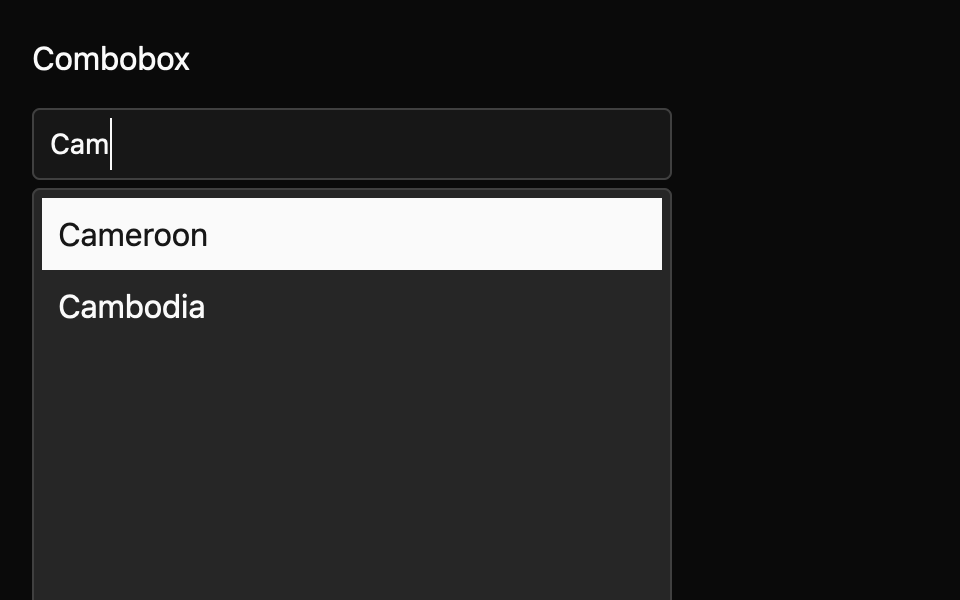

# Combobox

Type to filter a single-value option list, with optional custom text. This E7 component is a draft with an `implementation_in_progress` registry entry. Its public contract needs maintainer review.

*Dark theme, 2× baseline capture: `open_filtered` state.*

## API and state

`Combobox::new(label, options, default_value)` owns selection; `controlled(...)` asks an owner to apply `ValueChanged(String)` through `set_value`. `InputChanged(query)` reports user typing; `OptionSelected(id)` reports choosing a listed option; `OpenChanged(bool)` reports visibility. `Cancelled(session_start_value)` reports Escape rollback, and `Dismissed` reports Tab dismissal. `allow_custom_value(true)` permits a text commit. `set_options` replaces choices.

## Keyboard behavior

The component's named actions can be rebound by the host where applicable.

| Key or action | Current behavior |
| --- | --- |
| Printable text | Edit query and filter case-insensitively. |
| Up, Down | Open or move among enabled results. |
| Enter | Commit active option, or allowed custom text. |
| Escape | Close and restore session-start value. |
| Tab, Shift+Tab | Close without committing and traverse focus. |
| Alt+Down/Up | Open or close without changing text. |

## Accessibility

Requests EditableComboBox role, name, query value, expanded state and list autocomplete. Popup and visible rows request listbox/option semantics; active row uses GPUI focus mapping. A popup controls relationship, result announcements, and error association are unsupported by the pinned API. Eight generated accessibility cases remain pending.

## Theme tokens

Rendering reads GPUI Global control, text, list, surface/popover, selection, spacing, radius, and focus tokens. Popup uses an eight-row virtualized viewport.

## Usage scenarios

- Choose a project from a large list by typing part of its name.
- Enter a custom tag when `allow_custom_value(true)` permits a new value.
- Use a controlled customer chooser and apply `ValueChanged` after authorization checks.

## Verification and limits

9/9 generated keyboard cases, three GPUI interaction tests, five unit tests, and 48/48 screenshot comparisons passed. Platform accessibility and announcements remain open. These are focused draft checks, not release approval. The full E5 conformance matrix and maintainer review are outstanding. The current contract and evidence are in `registry/combobox/spec.md` and `docs/E7_AUDIT.md` in the repository.
