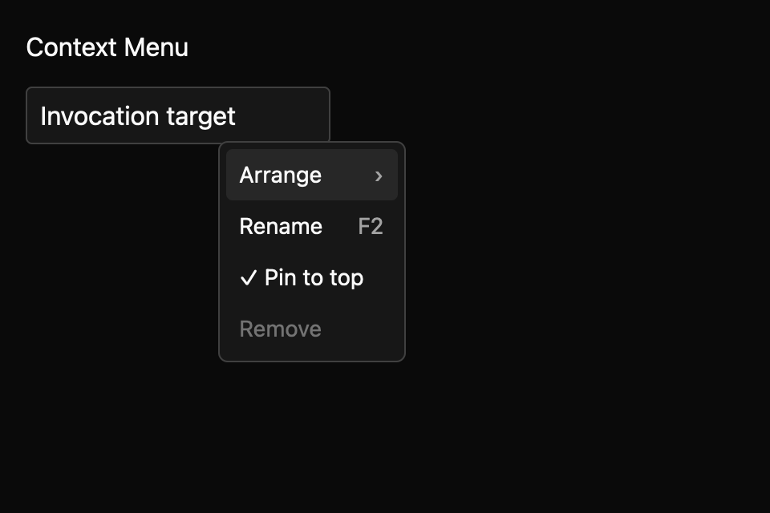

# Context menu

> **Draft E7 component.** Its public API, accessibility contract, and visual baselines still need maintainer review. It is not marked `source_ready` for `cargo mkit add`.

Use a context menu for commands related to the item someone just clicked or focused. The app supplies the context gesture and opening position.

## When to use it

- Right-click a file to show Rename, Pin, and Remove.
- Open the same commands from a focused row with the platform context-menu key or Shift+F10.
- Put Arrange commands in a submenu for a canvas object.

## Preview

This is a checked-in dark-theme, 2× screenshot baseline of one state. The component spec lists the other captured states, themes, and scales.

## API and state

`Entity<ContextMenu>`; uncontrolled `new(items)` and controlled `controlled(items, open)` both expose `set_open`. `OpenChanged(bool)` requests open state changes; in controlled mode the owner must call `set_open` to apply them. `ItemSelected(id)` is emitted for enabled command items, and dismisses the menu. `CheckedChanged(id, checked)` is emitted for enabled checkable items; toggling a checkable item keeps the menu open. Items support shortcuts, disabled, checked and children.

## Keyboard and pointer behavior

| Key | Behaviour |
|---|---|
| ContextMenu / Shift+F10 | Host opens at the focused item's anchor. |
| Up / Down | Move among enabled items in the current pane, wrapping at either end. |
| Right / Left | Open an active submenu / return to its parent item. |
| Enter / Space | Open an active submenu or activate its leaf. |
| Escape | Request dismissal of the root menu. |
| Home / End | Focus the first / last enabled item in the current pane. |

Pointer movement activates enabled rows. Clicking a submenu row opens its child pane; clicking a
leaf activates it. Checkable items toggle and keep the menu open. The host owns the opening gesture and supplies the point through `anchor_at` or `set_anchor`. The
menu routes outside pointer-down dismissal itself. `return_focus_to` supplies the invoking element;
without one, the menu captures the previously focused handle when it opens. Escape and outside
dismissal emit `OpenChanged(false)` and reset the active path. In controlled mode, close and focus
restoration wait until the owner applies `set_open(false)`. Reopening starts at the first enabled
root item.
Shortcut labels are display only and do not install key bindings.

## Accessibility

menu; host trigger retains its role; entries use menuitem/menuitemcheckbox, expose their label as the accessible name, and set the AccessKit disabled state on unavailable entries. Checkable entries expose their checked state.

## Theme

Read colors, typography, spacing, radii, border widths, and control sizing from the GPUI Global `Theme` tokens. Enabled, non-active menu rows use `Theme.colors.text`; disabled rows use `Theme.colors.disabled`; shortcut labels and submenu indicators use `Theme.colors.text_muted`. In shadcn themes, the pane uses `surface`, and the pointer-hovered or keyboard-active row keeps `text` over the web preview's subtle `text`/`background` mix (4% text in light, 12% in dark), with `radii.small` corners and the pane's `spacing.xsmall` inset. Other themes retain their accent/contrast active colors and `elevated_surface` pane. Shadows and motion are not used by this menu surface. Do not hard-code colors.

## Current limits

The host must wire the opening gesture, coordinates, and any nested overlay ordering.

For the exact state and event contract, see the checked-in `registry/context-menu/spec.md`. The [E7 overview](../everyday-components.md) tracks current test evidence; these pages are documentation drafts, not a claim that the full E5 conformance matrix has passed.
