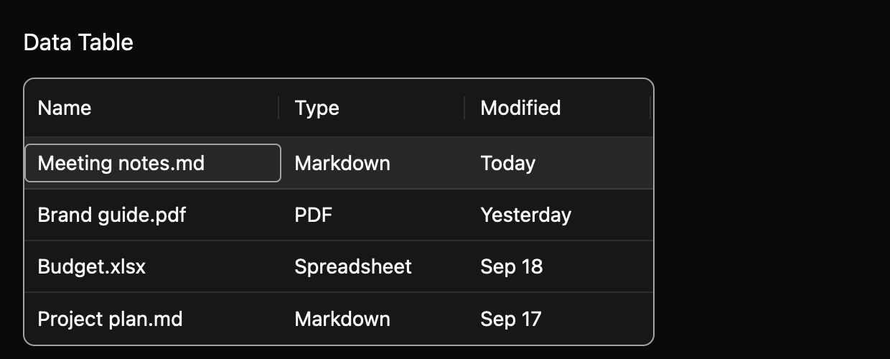

# Data table

> **Draft everyday component.** Its public API, accessibility contract, and visual baselines still need maintainer review. It is not marked `source_ready` for `cargo mkit add`.

A data table presents rows and columns that can be sorted and selected. Keyboard focus moves between cells while selection remains a separate choice.

## When to use it

- Sort recent files by name or date.
- Select several records for a bulk action.
- Resize columns in a compact admin grid.

## Preview

This is a checked-in dark-theme, 2× screenshot baseline of one state. The component spec lists the other captured states, themes, and scales.

## API and state

`DataTable::new` owns sort and selection; `controlled` accepts selected IDs and a sort descriptor and emits requests without applying them. `set_selection`, `set_sort`, and `set_rows` apply owner state. `set_rows` preserves the active row by ID and drops selected rows that disappeared. Column widths remain table-owned in both modes. `multi_select` toggles multiple selection. `sort_by` changes ascending/descending direction and sorts strings in uncontrolled mode. `resize_column` enforces a 24 px minimum and emits `ColumnResized`; default column width is 160 px. Navigation emits `ActiveChanged` when the active data row changes and `ActiveCellChanged` when the active coordinate changes. `with_cell_renderer` and `with_header_renderer` allow custom visual elements while row cell strings and column labels remain the accessible text. `RowActivated` reports a double-click, or Enter when `activate_on_enter(true)` is set; Space still selects a row.

## Keyboard and pointer behavior

| Key | Behavior |
| --- | --- |
| Arrow keys | Move the active cell across rows and columns, clamping at the edges. |
| Home / End | Move to the first or last column in the active row. |
| Enter | Sort an active sortable header or toggle the active data row’s selection. |

`MkitDataTable` binds arrows to cell navigation. Up/Down retain the column and move through the header and data rows; Left/Right move columns within the current row. Home/End move to the first/last column in the active row. Enter sorts an active sortable header or toggles selection of the active data row by default; the opt-in activation mode emits `RowActivated` on a row. Space toggles row selection. Navigation clamps at boundaries. Actions are rebindable.

Clicking a sortable column header calls `sort_by`. Clicking a data row makes its first cell active and toggles row selection. A 4px handle on the trailing edge of each header, drawn as a thin line, drags to resize that column, applying the same 24 px minimum as the API. Releasing the pointer ends the drag.

The table label, row IDs, header labels (`header-label-<column ID>`), and resize handles (`column-resize-<column ID>`) are stable GPUI debug selectors for pointer harness scripts.

## Accessibility

The root has grid role, accessible label, row count including header, and column count. Headers use columnheader role and expose sort state; data rows use row role, a name composed from their cell values, and `aria-selected`; cells use gridcell role and an accessible name composed from the corresponding column label and cell value. Root active-descendant identifies the active header or cell. Keyboard focus has a visible focus-token ring. The active header uses accent and accent-text emphasis; the active cell has a focus-token border independent of row selection.

## Theme

Theme background, surface, text, border, accent, accent text, focus; spacing, controls, radii, borders, typography tokens. Default width 160 px and minimum width 24 px are grid sizing policy values.

The table follows the shadcn/ui table. It sits in a bordered card with `radii.large` corners. The 40px header (`controls.large`) has no fill and medium-weight 14px labels; a sorted column shows a vector chevron. Rows are 36px (`controls.medium`) with 8px cell padding and hairline dividers, and the last row has none. Hover uses a half-strength muted fill and selected rows a muted fill; in the shadcn themes muted mixes `text` into `background`. Keyboard focus colours the table border, and the active header or cell has a `focus` outline inside it. Resize grips are thin lines. High contrast keeps a solid accent fill for selected rows. `row_divider` now defaults to `true`, and `row_divider(false)` removes the dividers. The spec records the exact token mapping.

## Verification and limits

Eight generated keyboard cases pass through a real GPUI adapter: six directional/Home/End movements, Enter row selection, and Enter header sorting, with explicit active-cell and ascending-sort assertions. Four registry tests and the examples check pass. The screenshot matrix passes 30/30 idle/selected/sorted/active-header/active-cell comparisons across three themes and two scales.

This is a basic grid; active-platform cell semantics and the declared accessibility cases still need verification, and the generated accessibility cases are pending because the headless test platform does not activate the accessibility tree. Maintainer API, spec, and visual review are outstanding.

For the exact state and event contract, see the checked-in `registry/data-table/spec.md`. The [everyday components overview](../everyday-components.md) tracks current test evidence.
