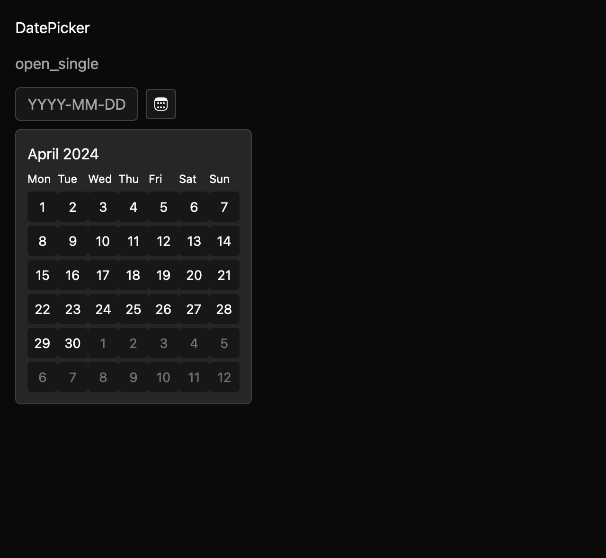

# Date picker and date range picker

DatePicker combines an editable date field with an anchored Calendar. DateRangePicker uses the same
view and calendar grid for start and end values. Both use `mkit_core::CivilDate`, without assuming a
timezone, date syntax, or locale.

The application supplies a parser and formatter, localized month and weekday names, and localized
field labels and validation messages. A valid typed date is a draft until Enter commits it. Invalid
text stays visible with its validation message. Escape restores the committed value and closes the
calendar. Selecting a date in the Calendar commits immediately. A typed range commits only when both
endpoints parse and pass the configured bounds and disabled-date predicate.

Controlled mode emits a typed change request and waits for the owner to update the value.
Uncontrolled mode stores the committed date or range and emits a change event. Both modes keep text
editing and calendar navigation available. The calendar grid comes directly from the Calendar
component; the date picker does not maintain a second date-grid implementation.

The API and its direct dependencies on `mkit-registry-calendar` and `mkit-registry-text_field` are a
draft pending maintainer review. Seven GPUI interaction tests cover typed commits, range validation,
Escape rollback, controlled updates, disabled input, and calendar selection. The macOS screenshot
matrix covers nine states across light, dark, and high-contrast themes at 1× and 2×. Native
accessibility tree snapshots are not yet available.

See `registry/date-picker/spec.md` for the state, event, keyboard, accessibility, and theme
contracts.
