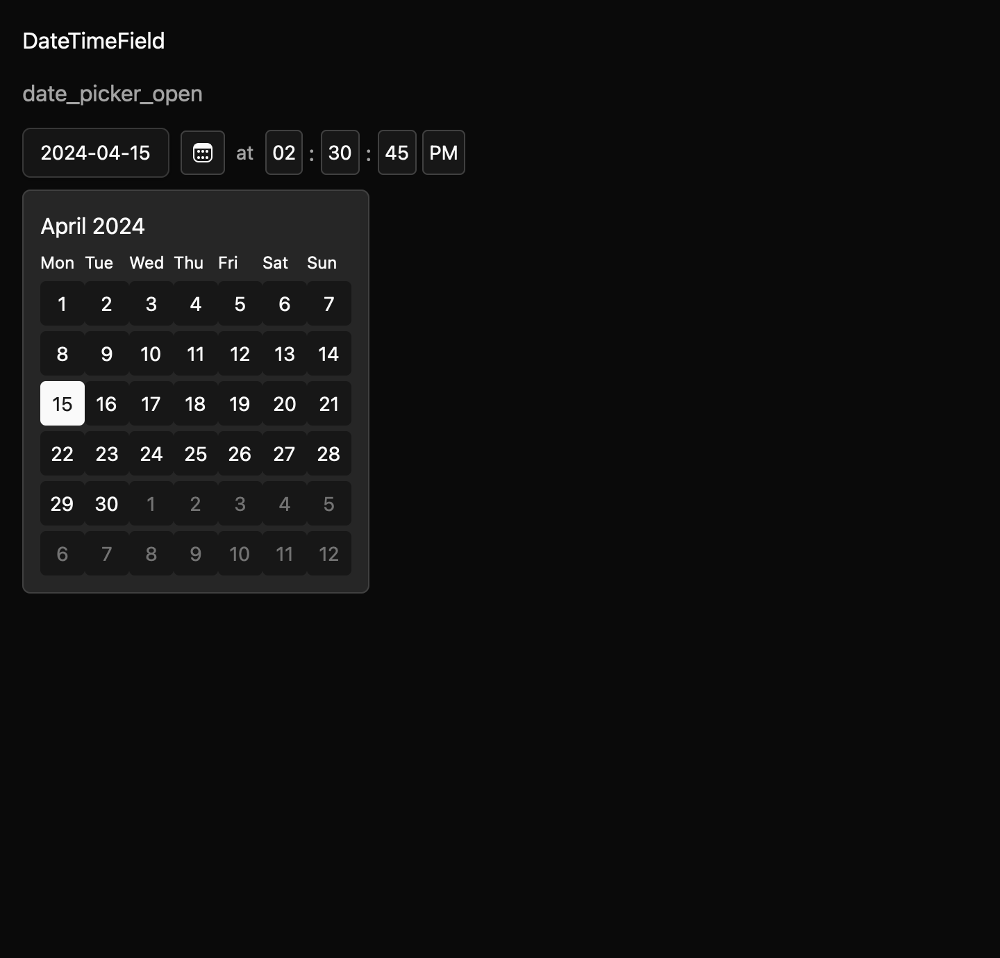

# DateTimeField

DateTimeField lays out an app-configured DatePicker, a localized separator, and an app-configured
TimeField in a named group. It reuses the DatePicker date grid and TimeField time segments; callers keep the
child entities and observe their date and time events independently.

The composition does not synthesize or atomically commit a combined value. This lets applications
apply their own timezone, validation, and date-time commit rules. Its direct dependency on
`mkit-registry-date-picker` is a documented draft exception pending maintainer approval.

The draft contract is in `registry/date-time-field/spec.md`. A focused GPUI test verifies that the
composition preserves TimeField values and events. The macOS screenshot matrix covers seven
states across three themes and two scales. Native accessibility tree snapshots and maintainer
review are pending.
