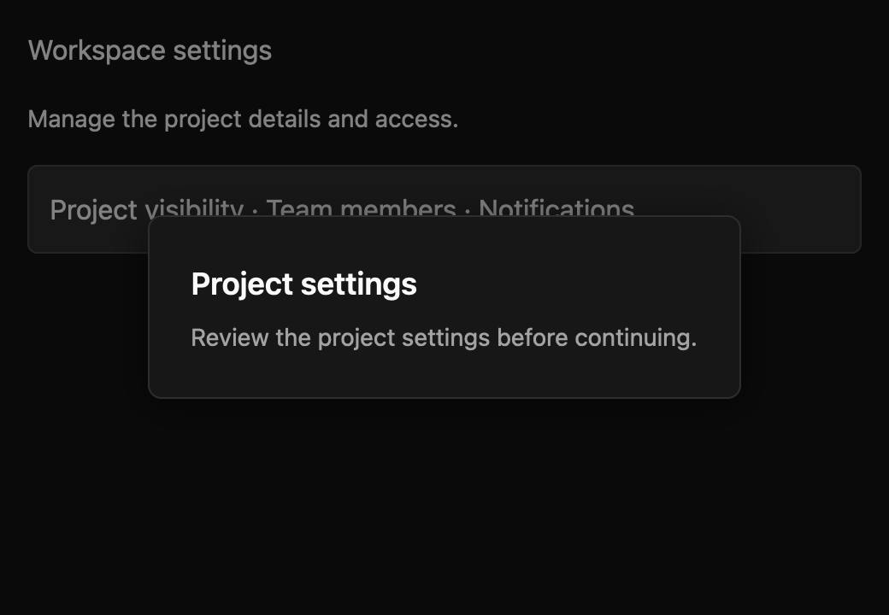

# Dialog

> **Draft everyday component.** Its public API, accessibility contract, and visual baselines still need maintainer review. It is not marked `source_ready` for `cargo mkit add`.

A dialog asks someone to complete or acknowledge a focused task. Its backdrop blocks the rest of the window while the dialog is open.

## When to use it

- Confirm deletion before removing a project.
- Collect a name and description before creating a workspace.
- Show an important decision that needs an explicit answer.

## Preview

This is a checked-in dark-theme, 2× screenshot baseline of one state. The component spec lists the other captured states, themes, and scales.

## API and state

`set_open` applies a supplied boolean; `is_open` reads it. In uncontrolled mode, Escape closes the surface and emits `OpenChanged(false)`. In controlled mode, Escape emits the same request but leaves `open` unchanged until `set_open`. The title and string content are fixed at construction. `with_content` accepts an element factory for interactive content. `focus_stops` optionally supplies exact focus handles in visual order; the caller must track those handles on the corresponding controls.

Without explicit stops, the dialog follows GPUI's rendered tab order inside its focus subtree and wraps at the edge. Hosts must hide the background accessibility subtree while a modal is open.

## Keyboard and pointer behavior

| Key | Behavior |
| --- | --- |
| Escape | Request dismissal unless busy. |
| Tab | Move to the next rendered stop or supplied stop, wrapping inside the dialog. |
| Shift+Tab | Move to the previous rendered stop or supplied stop, wrapping inside the dialog. |

`Dialog` key context binds Escape to `Dismiss`, Tab to `FocusForward`, and Shift+Tab to `FocusBackward`. Actions are rebindable. Escape has no effect when closed or busy. Without explicit stops, Tab follows rendered tab order and wraps to the dialog root if the next stop is outside. With supplied stops, Tab wraps across those handles in visual order, starting on the first stop at open.

The open backdrop fills the available host viewport. Pointer down outside the card requests dismissal unless busy, and is consumed by the backdrop so host controls cannot receive the press. The card is centered in that host-provided viewport; callers should mount the dialog at the window content root for viewport placement.

## Accessibility

The open card exposes AccessKit `dialog` role with the supplied title as its accessible name. While busy, a visible child exposes AccessKit `status` role, the name `Work in progress`, and the text `Dismissal is paused until this work finishes.` The root receives initial focus without explicit stops; the first supplied focus stop receives initial focus when provided. Tab is trapped within the dialog subtree, and the previously focused handle is restored on close when it remains alive. Backdrop blocks host pointer interaction. Closed root has no `dialog` role. An active-platform snapshot must verify the name and focus relationship.

## Theme

Dialog follows the shadcn/ui look: a 50% near-black backdrop and a card with the `surface` fill, hairline border, large radius, large shadow, and 24px padding. The title is 18px semibold and string content is muted description text. In dark themes the hairline is text at 10% opacity. The busy status uses a muted fill. The high-contrast theme uses a solid background card with a `border` outline. Colours, radii, spacing, shadows, and typography come from theme tokens; the spec's theme table lists each mapping, including the 6px and 18px values derived from neighbouring tokens.

## Current limits

Mount at the window content root for correct viewport placement. If supplying explicit focus stops, keep them synchronized with the actual enabled controls. The host must hide background accessibility content during a modal. Shift+Tab from the dialog surface stays on the surface instead of wrapping to the last control. For a multi-step flow inside a dialog, see [Stepper](stepper.md#inside-a-dialog-or-sheet).

For the exact state and event contract, see the checked-in `registry/dialog/spec.md`. The [everyday components overview](../everyday-components.md) tracks current test evidence; these pages are documentation drafts, not a claim that the full conformance matrix has passed.
