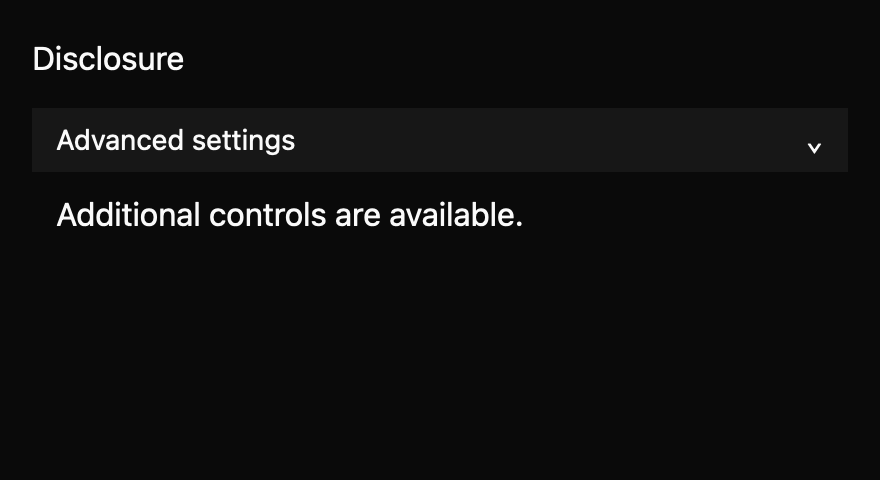
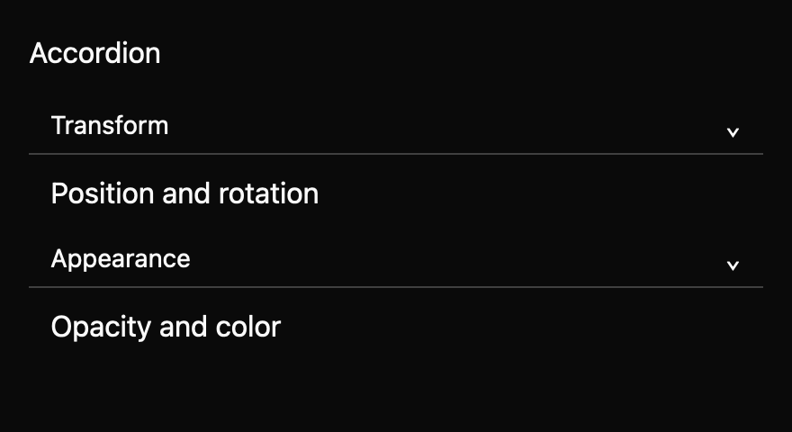

# Disclosure and accordion

Use a disclosure for one optional region and an accordion when several regions share a single-open
or multiple-open rule. Each header is a button that announces whether its panel is expanded.

`Disclosure` and `Accordion` are GPUI entity views. Their constructors accept content factories so
the panel can be rebuilt on each expansion. Own stateful controls in an application entity when
they must retain state while their panel is closed. Uncontrolled interactions update local state and
emit `ExpandedChanged`; controlled interactions emit a proposal and wait for `set_expanded` from the
owner. Disabled triggers ignore pointer and keyboard input.

Enter and Space toggle the focused trigger. Accordion headers keep ordinary Tab order; arrow-key
navigation is not part of this draft. Optional motion is off by default and only affects the
indicator. Panel visibility changes immediately.

The public API and accessibility mapping are draft and require maintainer review. The component
specs are maintained at `registry/disclosure/spec.md` and `registry/accordion/spec.md`.

