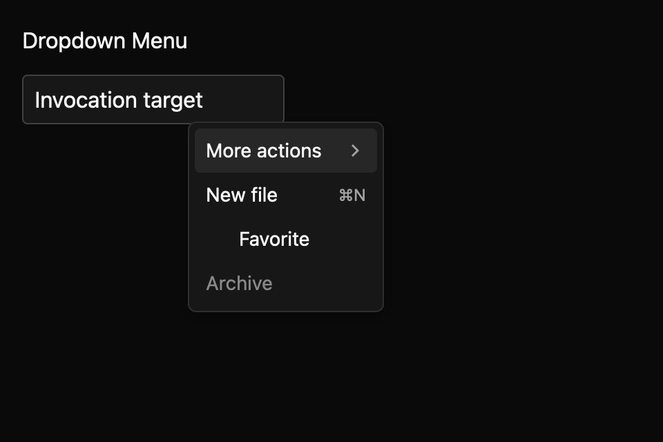

# Dropdown menu

> **Draft everyday component.** Its public API, accessibility contract, and visual baselines still need maintainer review. It is not marked `source_ready` for `cargo mkit add`.

Use a dropdown menu to put several commands behind a button without crowding the main screen. The app supplies the button and the point where the menu opens.

## When to use it

- Put Rename, Duplicate, and Archive behind a file toolbar button.
- Group export formats in a submenu while keeping common commands at the top level.
- Show a checked “Show hidden files” command alongside ordinary commands.

## Preview

This is a checked-in dark-theme, 2× screenshot baseline of one state. The component spec lists the other captured states, themes, and scales.

## API and state

`Entity<DropdownMenu>`; uncontrolled `new(items)` and controlled `controlled(items, open)` both expose `set_open`. `OpenChanged(bool)` requests open state changes; in controlled mode the owner must call `set_open` to apply them. `ItemSelected(id)` is emitted for enabled command items, and dismisses the menu. `CheckedChanged(id, checked)` is emitted for enabled checkable items; toggling a checkable item keeps the menu open. Items have id, label, disabled, optional shortcut, checked and children.

## Keyboard and pointer behavior

| Key | Behaviour |
|---|---|
| Up / Down | Move among enabled items in the current pane, wrapping at either end. |
| Right | Open the active enabled item's submenu and focus its first enabled item. |
| Left | Close the current submenu and restore its parent item as active. |
| Enter / Space | Open an active submenu or activate its leaf. |
| Escape | Request dismissal of the root menu. |
| Home / End | Focus the first / last enabled item in the current pane. |

Pointer movement activates enabled rows. Clicking a submenu row opens its child pane; clicking a
leaf activates it. Checkable items toggle and keep the menu open. The host owns the trigger and
supplies the point through `anchor_at` or `set_anchor`; the menu routes outside pointer-down
dismissal itself. `return_focus_to` supplies the invoking element, or the menu captures the
previously focused handle when it opens. Escape and outside dismissal emit `OpenChanged(false)`
and reset the active path. Reopening starts at the first enabled root item. Displayed shortcuts
do not invoke commands and do not install key bindings.

## Accessibility

menu; trigger button has aria-haspopup=menu and aria-expanded; entries use menuitem or menuitemcheckbox and expose their label as the accessible name. Disabled entries set the AccessKit disabled state. Checkable entries expose their toggled state, submenu parents expose expanded state, and the active row is reported through GPUI’s active-descendant accessibility mapping.

## Theme

Menus follow the shadcn/ui look: a popover pane on the surface colour with a 1px border (a 10% text border in dark themes), `radii.medium` corners, a medium shadow, 4px padding, and a 128px minimum width. Rows are 32px tall with 8px padding, 14px labels, and small rounded corners. The pointer-hovered or keyboard-active row, and a submenu parent while its child pane is open, gets the muted accent fill (text mixed 4% into the background in light themes, 12% in dark themes). Checkable items show a drawn check mark in a leading 16px slot, submenu parents end with a drawn chevron, and shortcuts are right-aligned in 12px muted text. Disabled rows render at 50% strength over the pane. The high-contrast theme keeps a black pane with a white border, a solid accent-filled active row with accent text, thicker icon strokes, and solid `disabled` text for unavailable rows. `MenuItem` has no group label, separator, icon, or destructive variant, so those parts of the web preview are not drawn. The spec's theme table lists each token mapping.

## Current limits

Menu commands and displayed shortcuts are separate: showing a shortcut does not register it.

Shortcut labels go through the shared [KeyHint](key-hint.md) formatter, so menus, the command palette, and the shortcut editor show the same platform key names. A label written as `⌘⇧S` or `cmd-shift-s` appears as `⇧⌘S` on macOS and `Shift+Super+S` on other platforms. Text the formatter cannot read, such as a two-step sequence, is shown as written. The shortcut keeps its muted inline text style rather than keycap boxes.

For the exact state and event contract, see the checked-in `registry/dropdown-menu/spec.md`. The [everyday components overview](../everyday-components.md) tracks current test evidence; these pages are documentation drafts, not a claim that the full conformance matrix has passed.
