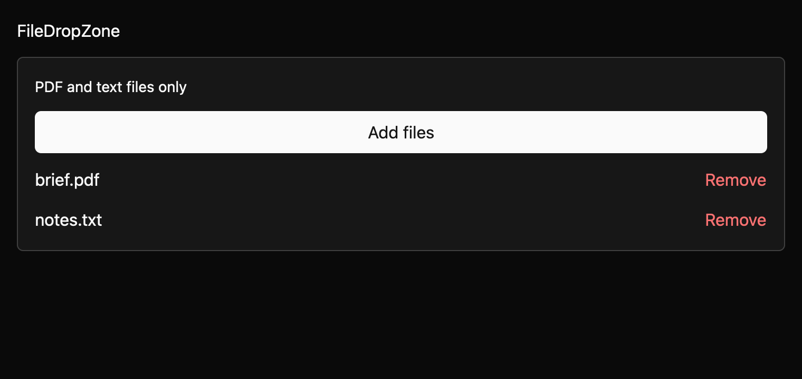

# FileDropZone

`FileDropZone` accepts filesystem paths dropped from the operating system and provides a keyboard
Browse button that opens GPUI's platform file picker. Accepted files appear with Remove controls.
Consumers own file reading and content validation.

*Selected files, dark theme, 2× baseline capture.*

## Keyboard and ownership

Tab reaches Browse and then enabled Remove buttons. Enter and Space activate these controls; after an
uncontrolled removal, focus moves to the next row, previous row, or Browse. Omitting `.files(...)`
uses internal selection; `.default_files(paths)` seeds an uncontrolled selection. Supplying files makes it controlled: apply each `FilesChange` proposal via
`set_files`.

## Native file behavior

GPUI routes OS file paths to the drop target. Extension filters run after GPUI provides paths; its
picker options do not accept file-type filters. A suffix match is a user-interface filter and does
not inspect file content. Headless coverage skips drag-hover images because synthetic test data would
not prove OS drag support. Native drop and picker behavior still needs platform testing.

See `docs/E7_FILE_INPUTS.md` and `registry/file-drop-zone/spec.md` in the repository.
