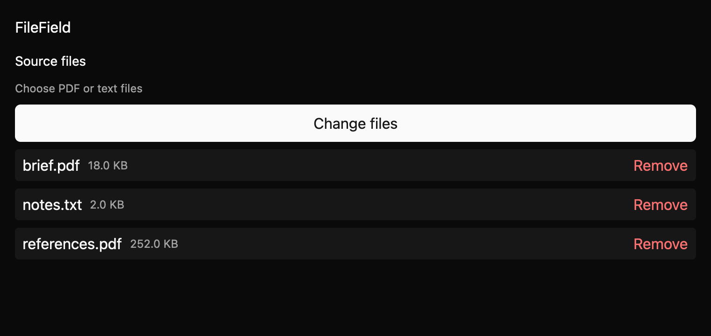

# FileField

`FileField` is a labeled file-selection field with a native Browse action and removable file rows. It
can stand alone or display a selection also handled by `FileDropZone`.

*Multiple selected files, dark theme, 2× baseline capture.*

## Keyboard and ownership

Tab visits Browse and enabled Remove actions in row order. Enter and Space activate each button.
After an uncontrolled removal, focus moves to the next row, previous row, or Browse. Omitting
`.files(...)` uses internal state; supplying files makes the field controlled and requires the parent
to apply each `FilesChange` proposal through `set_files`.

The field emits `BrowseRequested`, then uses GPUI's platform picker. Unsupported suffixes generate a
`FileRejected` event and a polite status update. File contents are never inspected. GPUI's picker
API cannot pass extension filters, so suffix checks run on the returned paths.

See `docs/E7_FILE_INPUTS.md` and `registry/file-field/spec.md` in the repository.
