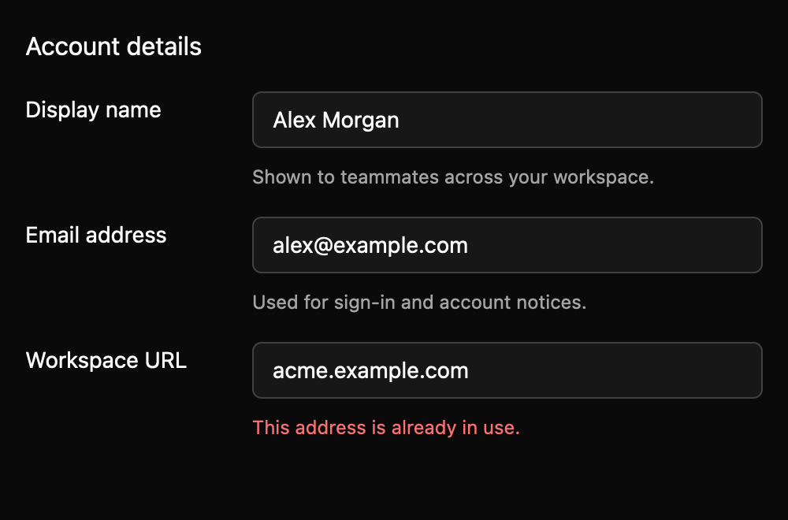

# Form layout

> **Draft everyday component.** Its public API, accessibility contract, and visual baselines still need maintainer review. It is not marked `source_ready` for `cargo mkit add`.

Form layout aligns labels, controls, helper text, and errors so a form is easy to scan.

## When to use it

- Lay out profile fields with short descriptions.
- Use compact spacing in a dense settings panel.
- Show a validation error below its matching control.

## Preview

This is a checked-in dark-theme, 2× screenshot baseline of one state. The component spec lists the other captured states, themes, and scales.

## API and state

`label_width` sets the label column width in logical pixels (clamped to zero or greater); the default is four `spacing.xxlarge` units. `compact` selects denser row, label/control, and helper-text spacing. `label` names the group. A row contains a visible label, a control, and optional description and error. The component is stateless and emits no events.

## Keyboard and pointer behavior

| Key | Behavior |
| --- | --- |
| None | The layout registers no keys; child controls keep their own bindings and tab order. |

No layout key bindings. Child controls keep their own key contexts and tab order.

The layout adds no pointer behavior; controls keep theirs.

## Accessibility

The root has the `group` role and an optional accessible name from `label`. Callers should associate each control with its visible row label; layout text alone does not set the child's accessible name. Child controls retain their own accessibility semantics.

## Theme

`Theme.spacing.xsmall/small/medium/large/xxlarge`, `Theme.typography.body/caption`, and `Theme.colors.text/text_muted/danger`. No component colors or fixed sizes are hard-coded.

## Verification and limits

The registry crate check and test commands pass, and the dedicated screenshot test passes 12/12 default/compact comparisons across three themes and two scales. There is no focused interaction test: the layout registers no keys and emits no events by design.

Callers must connect each visible label to its control's accessible name; layout text alone does not set it. Rows stay horizontal at every width. Active-platform accessibility and maintainer contract, visual, and book review are outstanding.

For the exact state and event contract, see the checked-in `registry/form-layout/spec.md`. The [everyday components overview](../everyday-components.md) tracks current test evidence.
