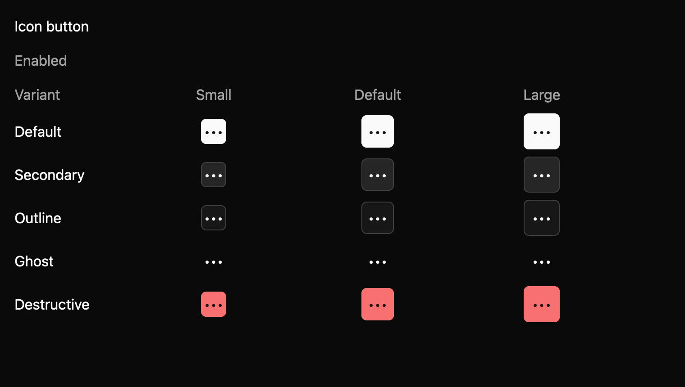

# Icon button

Trigger a compact icon action when surrounding context makes placement useful. This E7 component is a draft with an `implementation_in_progress` registry entry. Its public contract needs maintainer review.

*Dark theme, 2× baseline capture: `idle` state.*

## API and state

`IconButton::new(label, icon)` requires a meaningful accessible label. Variant, size, and disabled are builders. `on_activate` handles primary click and keyboard activation; `on_click` is pointer-only and precedes it when both are present. Disabled suppresses callbacks.

## Keyboard behavior

The component's named actions can be rebound by the host where applicable.

| Key or action | Current behavior |
| --- | --- |
| Enter, Space | Activate when enabled and focused. |

## Accessibility

Requests button role and the supplied accessible name. The icon is decorative. Disabled leaves Tab order and requests disabled state plus an “Unavailable” description. Active-platform announcement remains unverified.

## Theme tokens

Colors: surface, text, border, accent, focus, danger, disabled. Spacing: small/medium. Radius: small. Border: regular.

## Usage scenarios

- Close a dismissible panel with a labelled Close icon.
- Open search from a toolbar with a labelled Search icon.
- Show a More options menu beside an item, with that exact accessible name.

## Verification and limits

Enter/Space adapter and focused pointer tests passed. 12/12 declared screenshot comparisons passed; platform accessibility remains open. These are focused draft checks, not release approval. The full E5 conformance matrix and maintainer review are outstanding. The current contract and evidence are in `registry/icon-button/spec.md` and `docs/E7_AUDIT.md` in the repository.
