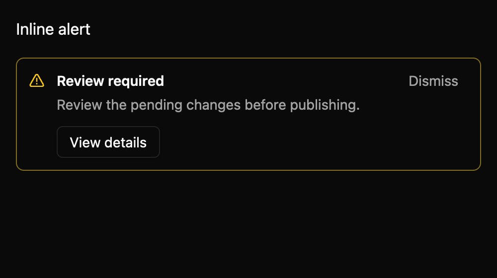
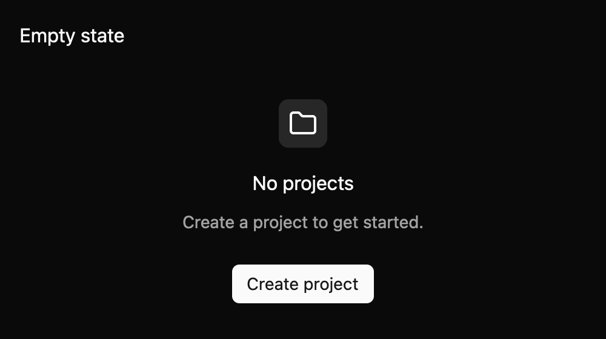

# Inline alert and empty state

Use an inline alert to explain a local result or issue. It supports info, success, warning, and
error severity. Info and success use polite status semantics; warning and error use assertive alert
semantics. A dismiss button hides an uncontrolled alert and emits `DismissRequested`. In controlled
mode it emits a proposal and waits for the owner to call `set_dismissed`. An optional action emits
`ActionInvoked`; the application owns the operation that follows.

`EmptyState` is a stateless `RenderOnce` layout for an app-provided icon, title, optional description,
and caller-owned actions. It gives an empty view context and a next step without taking ownership of
the action behavior.

Both components read colors, spacing, and typography from the mkit-core Global theme. The current
API is draft and needs maintainer review. The component specs are maintained at
`registry/inline-alert/spec.md` and `registry/empty-state/spec.md`; implementation notes are in
`docs/E7_INLINE_MESSAGES.md`.

The gallery matrix passed for all nine declared states across light, dark, and high-contrast themes
at 1× and 2× scales. These are visual checks; live-region announcement timing and active-platform
accessibility snapshots still need native assistive-technology validation.
