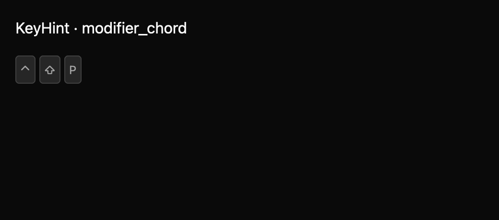

# KeyHint

KeyHint presents modifier chords in platform-aware form. Apps supply the main key label so special keys can be localized. This draft is a standalone display primitive; menus, CommandPalette, and ShortcutEditor adoption is a follow-up integration.

The draft registry contract is in `registry/key-hint/spec.md`. The screenshot matrix spans declared states, three themes, and two scales. Platform glyph support, spoken labels, and API review remain pending.
