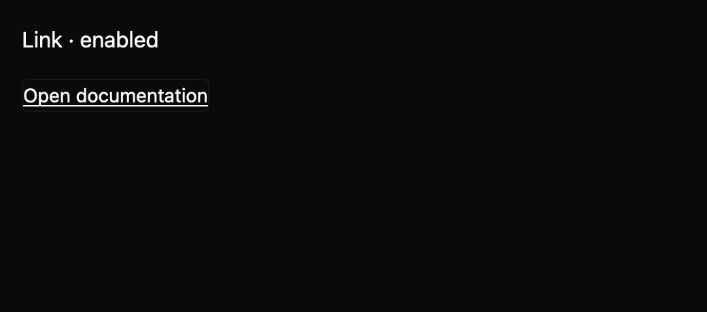

# Link

Link renders focusable text with a semantic link role when an activation callback is supplied. Enter dispatches the rebindable `Activate` action in the `MkitLink` context; primary pointer clicks call the same callback. Apps own destination resolution and navigation.

The draft registry contract is in `registry/link/spec.md`. The screenshot matrix spans declared states, three themes, and two scales. Callback navigation semantics and native accessibility snapshots need maintainer review.
