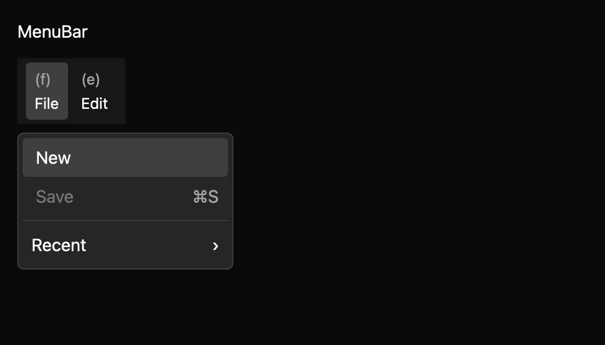

# MenuBar

MenuBar provides an in-window application menu surface with APG-style keyboard navigation. Define
the menus and their GPUI actions once with `MenuBarModel`; `to_gpui_menus()` converts the same tree
to GPUI's native menu model for app-level integration. The in-window renderer is especially useful
on platforms where GPUI stores the app menu but does not draw it in the application window.

The bar supports explicit top-level mnemonics, nested submenus, displayed shortcuts, disabled
commands, and checked commands. `OpenMenuChanged` reports popup-state requests in controlled mode;
`CommandInvoked` reports the stable ID of an activated command. The public API and keyboard/AX
contract are drafts pending maintainer review. Native accessibility and keyboard behavior need
platform validation.

