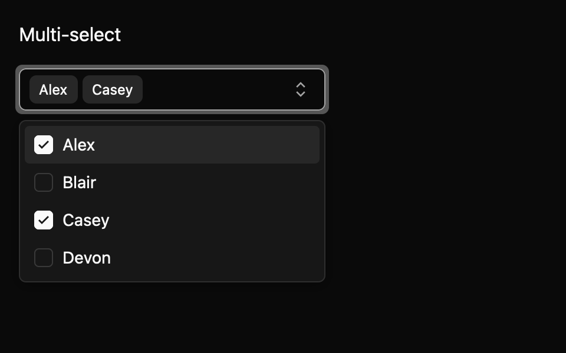

# Multi-select

Choose zero or more IDs from a bounded option list. This everyday component is a draft with an `implementation_in_progress` registry entry. Its public contract needs maintainer review.

*Dark theme, 2× baseline capture: `open` state.*

## API and state

`MultiSelect::new(label, options, default_values)` owns selected IDs; `controlled(...)` emits `ValuesChanged(Vec<String>)` requests until the owner calls `set_values`. `OpenChanged(bool)` reports visibility. `values()`, `is_open()`, and `active_option_id()` expose state. Clicking a row toggles it without closing.

## Keyboard behavior

The component's named actions can be rebound by the host where applicable.

| Key or action | Current behavior |
| --- | --- |
| Arrow keys, Home, End | Move the active row among enabled options. |
| Enter, Space | Open or toggle active membership. |
| Escape | Close without changing values. |
| Tab, Shift+Tab | Close and traverse focus while preserving selected values. |

## Accessibility

Requests a named combobox trigger with expanded state and selected labels joined in option order as its value. Popup requests multiselectable listbox and option selection/disabled state. A scoped macOS check observed trigger values; full platform semantics remain unverified.

## Theme tokens

Multi-select shares Select's input-style trigger, popover surface, and 32px rows. Selected values appear in the trigger as small secondary chips (12px medium text, `radii.medium` corners), with a muted placeholder when nothing is selected and a vector up-down chevron. Each row leads with a decorative checkbox that matches Checkbox, and the active row takes a muted fill. Disabled parts render at 50%. Keyboard focus adds a focus-coloured border and a 3px ring. The high-contrast theme keeps white borders, outlined chips, and a solid accent row. The popup shows up to eight virtualized rows and flips above near the window bottom. The spec's theme table lists each token mapping.

## Usage scenarios

- Assign multiple teams to a project.
- Choose several report columns from a long list.
- Keep controlled selected tags in an owner-owned filter state.

## Verification and limits

9/9 keyboard cases, 8/8 registry tests, and 24/24 screenshot comparisons passed. Active-platform accessibility remains open. These are focused draft checks, not release approval. The full conformance matrix and maintainer review are outstanding. The current contract and evidence are in `registry/multi-select/spec.md` and `docs/E7_AUDIT.md` in the repository.
