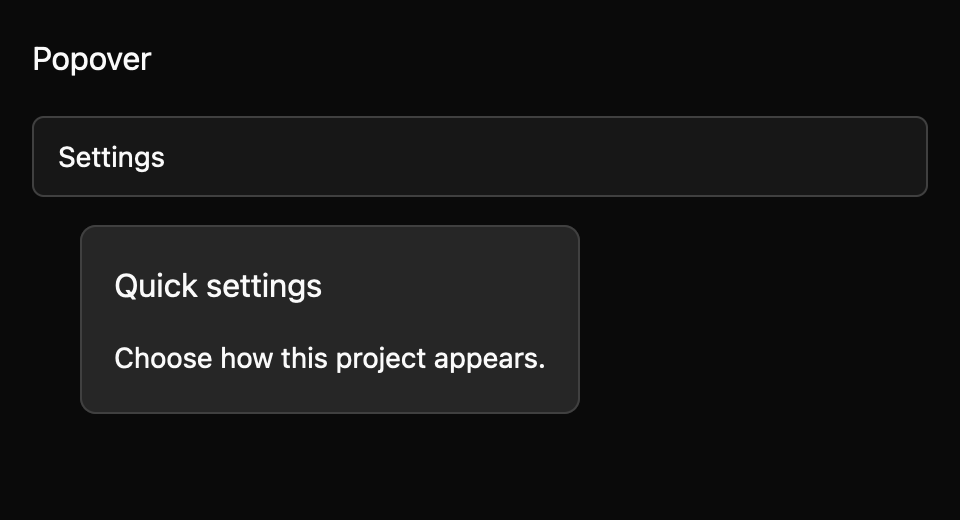

# Popover

> **Draft E7 component.** Its public API, accessibility contract, and visual baselines still need maintainer review. It is not marked `source_ready` for `cargo mkit add`.

A popover opens a small, nonmodal panel from its own trigger. It is useful for extra information or a short interaction while the rest of the page stays available.

## When to use it

- Show a filter panel from a toolbar button.
- Open a short explanation next to a setting.
- Let someone pick a date without leaving the current screen.

## Preview

This is a checked-in dark-theme, 2× screenshot baseline of one state. The component spec lists the other captured states, themes, and scales.

## API and state

The `title`, `content`, and trigger label are fixed strings. `OpenChanged(bool)` reports trigger and dismissal requests. Controlled mode is authoritative until the owner calls `set_open`; uncontrolled mode applies the request immediately. Placement uses the last measured surface height and trigger bounds. Until the first surface measurement, the surface remains visually transparent; its layout and measurement still run.

## Keyboard and pointer behavior

| Key | Behavior |
| --- | --- |
| Enter / Space on trigger | Activate the button trigger to open or close the surface. |
| Escape | Request dismissal while open, unless busy. |
| Tab / Shift+Tab | Follow normal page focus order; the popover does not trap focus. |

The `Popover` key context binds Escape to `Dismiss`. The action is rebindable. Escape has no effect when closed or busy. The trigger uses button semantics and GPUI click activation. Tab remains in the ordinary document order; this nonmodal popover does not trap focus.

Clicking the trigger opens or closes the surface. A pointer press outside the rendered surface requests dismissal. The trigger is treated as part of the popover interaction and toggles it directly. Nested overlay routing remains the host's responsibility; dispatch dismissal to the topmost surface first.

## Accessibility

The open surface has AccessKit `dialog` role. The trigger has button role and is keyboard focusable. The component returns focus to the trigger after close. It is nonmodal and does not trap focus.

## Theme

The outlined trigger reads `surface`, `text`, `border`, `spacing.small/medium`, `radii.medium`, `borders.regular`, and `typography.body` from GPUI `Theme`. The floating surface reads `elevated_surface`, `text`, `border`, `spacing.medium/large`, `radii.large`, `borders.regular`, `typography.body`, and `typography.heading_small`.

## Current limits

This surface does not trap focus; the host is responsible for ordering nested overlays.

For the exact state and event contract, see the checked-in `registry/popover/spec.md`. The [E7 overview](../everyday-components.md) tracks current test evidence; these pages are documentation drafts, not a claim that the full E5 conformance matrix has passed.
