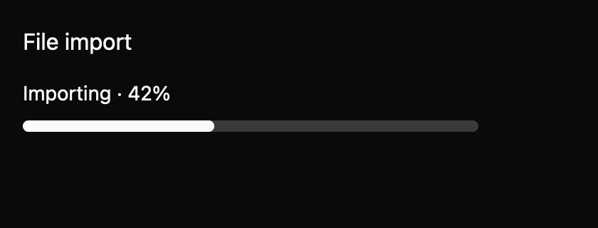

# Progress

Show task completion without accepting input. This everyday component is a draft with an `implementation_in_progress` registry entry. Its public contract needs maintainer review.

*Dark theme, 2× baseline capture: `partial` state.*

## API and state

`Progress::new(label, value)` creates determinate progress; `range(min, max)` changes bounds and `indeterminate()` omits a known current value. The caller updates props. There are no events.

## Keyboard behavior

The component's named actions can be rebound by the host where applicable.

| Key or action | Current behavior |
| --- | --- |
| None | Not focusable; no keyboard actions. |

## Accessibility

Requests progressbar role, name, and bounds. Determinate current value is clamped. Indeterminate mode omits current value and requests an “In progress” description; it has no live region or busy property. Native announcements are pending.

## Theme tokens

Global border/accent colors, radii.pill, spacing.xsmall. The centered 35% indeterminate segment is a static placeholder awaiting animation and reduced-motion review.

## Usage scenarios

- Show a file upload at 64%.
- Show import progress before a percentage is available.
- Show completion at the end of a multi-step local task.

## Verification and limits

24/24 declared screenshot comparisons passed. No input adapter is applicable; platform announcements remain unverified. These are focused draft checks, not release approval. The full conformance matrix and maintainer review are outstanding. The current contract and evidence are in `registry/progress/spec.md` and `docs/E7_AUDIT.md` in the repository.
