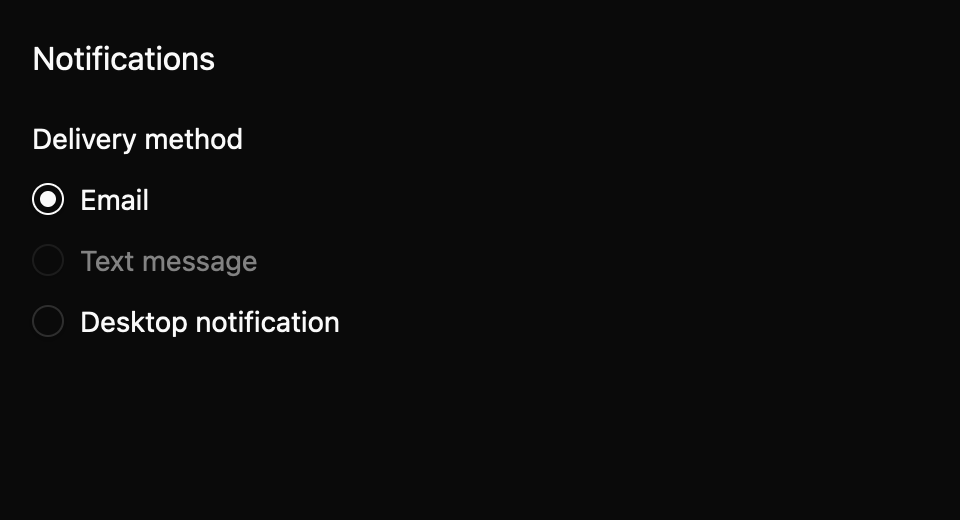

# Radio group

Choose one option from a labelled set. This everyday component is a draft with an `implementation_in_progress` registry entry. Its public contract needs maintainer review.

*Dark theme, 2× baseline capture: `first_selected` state.*

## API and state

`RadioGroup::new(label, options, default_value)` owns the selected ID; `controlled(...)` emits `ChangeRequested(id)` until the owner calls `set_value`. Options use stable IDs and can be disabled. `None` allows no initial selection. Orientation defaults to vertical.

## Keyboard behavior

The component's named actions can be rebound by the host where applicable.

| Key or action | Current behavior |
| --- | --- |
| Vertical Up/Down or horizontal Left/Right | Move and select among enabled options, wrapping. |
| Home, End | Select first or last enabled option. |
| Space | Select focused option. |

## Accessibility

Requests a labelled radiogroup with radio children, checked and disabled state, and orientation. Roving focus gives one enabled option a Tab stop. A disabled group has none. Native screen reader behavior remains open.

## Theme tokens

Global surface, text, border, accent, focus, disabled; spacing.small, radii.pill, borders.hairline/regular, typography.body.

## Usage scenarios

- Choose a billing plan from Basic, Plus, and Team.
- Choose a horizontal display density in a compact toolbar.
- Use a controlled shipping method group and apply requests only after availability checks.

## Verification and limits

8/8 generated keyboard cases and focused pointer/Space tests passed. 36/36 screenshot comparisons passed; six accessibility cases remain pending. These are focused draft checks, not release approval. The full conformance matrix and maintainer review are outstanding. The current contract and evidence are in `registry/radio-group/spec.md` and `docs/E7_AUDIT.md` in the repository.
