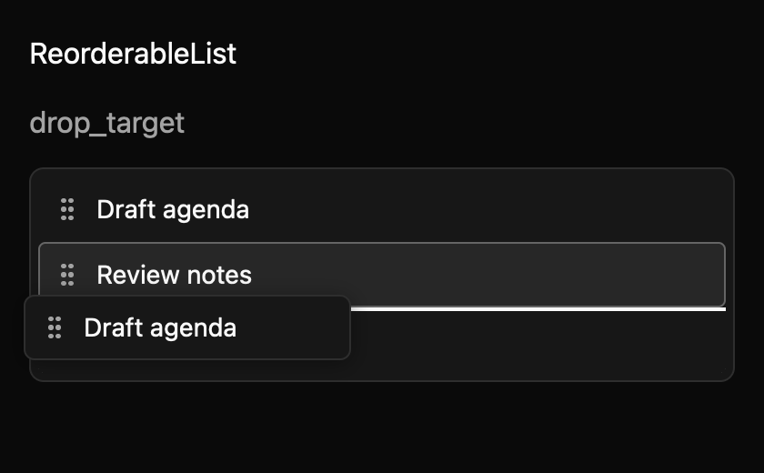

# ReorderableList

A stateful flat list for ordered records. It supports pointer drag-and-drop and reordering the active row with `Alt+ArrowUp` and `Alt+ArrowDown`. Each row has a stable ID and caller-provided label.

Use uncontrolled mode when the component may apply reorders locally. Controlled mode emits a move request and waits for the owner to call `set_items`; this keeps the displayed order aligned with app state. A move request identifies the item and its source and destination positions.

The list exposes list/list-item roles and row position/set-size metadata. Empty text and labels come from the app so callers can localize them. Live-region announcement timing still needs native accessibility verification.

The list is a bordered card with 4px padding. Rows are 36px with a vector grip, `radii.small` corners, and an accent hover fill. The active row has a muted fill and a faint outline that turns into a solid `focus` outline with keyboard focus. A 2px line in the primary colour marks the drop position. Disabled rows mix their colours 50% into the list surface. High contrast uses a solid accent fill for the active row. The spec records the exact token mapping.

This draft targets short and medium flat collections. It does not virtualize, and drag across offscreen rows is unsupported. VirtualList and LayerPanel have different row/tree contracts; integration remains a maintainer review gate.
