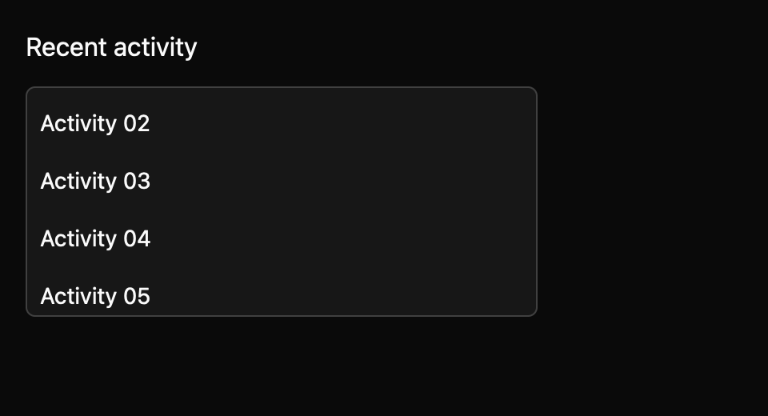

# Scroll area

> **Draft E7 component.** Its public API, accessibility contract, and visual baselines still need maintainer review. It is not marked `source_ready` for `cargo mkit add`.

A scroll area keeps overflow inside one bounded panel while the rest of the screen stays put.

## When to use it

- Scroll an activity feed beside a static summary.
- Keep a long settings list inside a small pane.
- Show a chat history within a fixed-height card.

## Preview

This is a checked-in dark-theme, 2× screenshot baseline of one state. The component spec lists the other captured states, themes, and scales.

## API and state

`height`, optional `width`, `id`, optional reusable `ScrollHandle`, and child content; no component events. Stateless `RenderOnce` builder. Callers retain the handle and ID across rerenders to retain scroll position.

## Keyboard and pointer behavior

| Key | Behavior |
| --- | --- |
| Page Up / Page Down | Scroll by one viewport. |
| Home / End | Scroll to the top or bottom. |
| Up / Down | Scroll by two large spacing units; stop at the bounds. |

Page Up/Down move by one viewport, Home/End move to the top/bottom, and arrows move by twice `Theme.spacing.large` (32 px in the dark-theme fixture). They clamp at the scroll bounds. The `MkitScrollArea` key context exposes named scroll actions so applications can rebind them.

Wheel or trackpad scrolling and native scrollbar dragging use GPUI scrolling.

## Accessibility

Expose a named scroll-view region when `label` is supplied. Content retains its own semantics.

## Theme

`Theme.colors.surface`, `Theme.colors.border`, `Theme.borders.hairline`, and `Theme.radii.medium`.

## Verification and limits

Six generated keyboard cases (PageDown, PageUp, End, Home, ArrowDown, ArrowUp) pass through a real GPUI adapter built on a scrolled fixture, checking clamping, end positions, and line offsets; a focused overflowing-viewport test and package Clippy pass alongside them. The screenshot matrix passes 12/12 idle/scrolled comparisons across three themes and two scales.

Keep a stable ID and scroll handle across rerenders if scroll position should persist. Keyboard wiring needs checks on all supported platforms, and the generated accessibility cases are pending because the headless test platform does not activate the accessibility tree. Active-platform accessibility and maintainer API, spec, and visual review are outstanding.

For the exact state and event contract, see the checked-in `registry/scroll-area/spec.md`. The [E7 overview](../everyday-components.md) tracks current test evidence.
