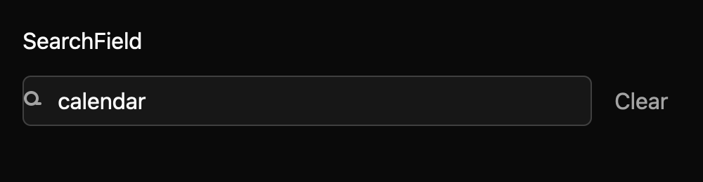

# Search field

Use SearchField to give list and panel filtering a shared input pattern. It combines a decorative
search icon inside the input border, the shared native text editor, an optional result count, and a
clear control for an enabled, non-empty query. TextField supplies selection, clipboard, Unicode, and
IME behavior.

Uncontrolled edits update the displayed query and emit `SearchChanged`. Controlled edits emit the
same typed proposal while the owner remains the source of truth; call `set_query` to accept or correct
the value. Optional debounce coalesces typing; clear-button and Escape actions always clear
immediately. `FocusSearch` defaults to Cmd+F and can be rebound by the host application.

The container is a named group. The editor currently exposes TextField's text-input role rather than
a dedicated searchbox role; the clear action is a named button and result counts are polite status
content. Native announcement behavior still needs an active-platform accessibility check.

The documented TextField crate dependency and its new leading-inset builder are draft exceptions
pending maintainer approval. The component specification lives at
`registry/search-field/spec.md`.

