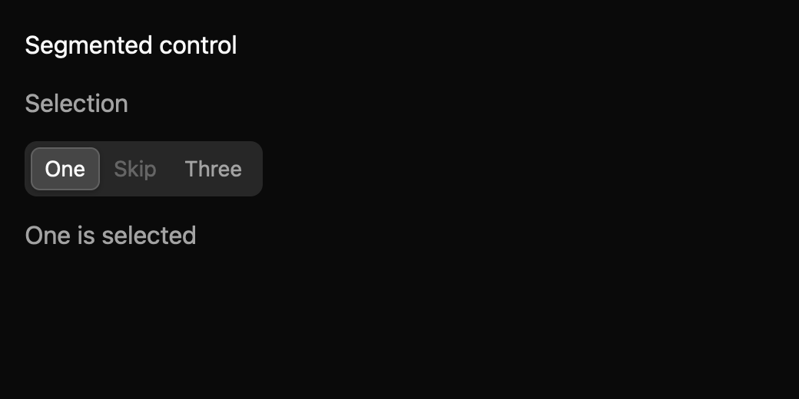

# Segmented control

> **Draft everyday component.** Its public API, accessibility contract, and visual baselines still need maintainer review. It is not marked `source_ready` for `cargo mkit add`.

Use a segmented control for one choice among a few compact alternatives. Unlike tabs, arrow navigation also changes the selected choice.

## When to use it

- Choose List or Grid view.
- Set a small chart range such as Day, Week, or Month.
- Switch text alignment among a few options.

## Preview

This is a checked-in dark-theme, 2× screenshot baseline of one state. The component spec lists the other captured states, themes, and scales.

## API and state

Label, options, selected/default value, disabled state, and orientation. `ValueChanged(Option<String>)` fires on accepted pointer or keyboard selection requests; in controlled mode this is a proposal and the displayed selection changes only after `set_value`. Each `Item` may include `.tooltip("help text")`; it adds delayed hover help and the same text as the radio's accessible description without adding another focus stop.

## Keyboard and pointer behavior

| Key | Behavior |
| --- | --- |
| Left / Right or Up / Down | On the configured axis, move focus and select the next enabled option. |
| Home / End | Focus and select the first or last enabled option. |
| Space | Select the focused option. |

Arrow keys for the configured orientation, plus Home/End, move focus and select an enabled option; selection follows focus as required by the radio-group pattern. Space selects the focused option. Actions are registered in `MkitSegmentedControl`; orthogonal arrow keys do nothing.

Click an enabled option to focus and request selection. Clicking a disabled option has no effect.

## Accessibility

Labeled radiogroup with horizontal or vertical orientation. Each item is a radio with checked state; one enabled option is the roving tab stop. Disabled options are skipped and described as unavailable. Optional deselection is unsupported.

## Theme

The segmented control shares the Tabs styling: a borderless, rounded track filled with a muted mix of text over background, and the checked option as a raised pill (background fill with a small shadow in light themes; a 15% text fill and border in dark themes). Unchecked labels use muted text, disabled options render at 50% opacity, and keyboard focus adds a focus-coloured border and a 3px ring. The high-contrast theme keeps a bordered track, an accent-filled checked option, and an opaque focus ring. Colours, radii, spacing, control height, and typography come from theme tokens; the spec's theme table lists each mapping.

## Verification and limits

Eight generated keyboard cases pass through a real GPUI adapter, covering arrow selection, Home/End, and Space; three package tests pass alongside them. The screenshot matrix passes 36/36 comparisons across six states, three themes, and two scales.

Optional deselection is unsupported; the component follows a radio-group model, and the removal of the earlier `allow_empty` API needs maintainer review. The generated accessibility cases are pending because the headless test platform does not activate the accessibility tree. The full conformance matrix and maintainer API, spec, and visual review are outstanding.

For the exact state and event contract, see the checked-in `registry/segmented-control/spec.md`. The [everyday components overview](../everyday-components.md) tracks current test evidence.
