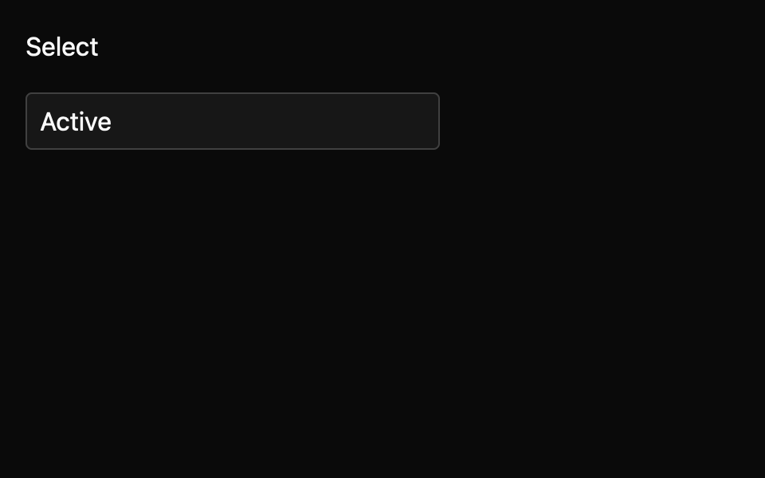

# Select

Choose one value from a bounded option list. This E7 component is a draft with an `implementation_in_progress` registry entry. Its public contract needs maintainer review.

*Dark theme, 2× baseline capture: `closed` state.*

## API and state

`Select::new(label, options, default_value)` owns the committed ID; `controlled(...)` emits `ValueChanged(Option<String>)` requests until the owner calls `set_value`. `OpenChanged(bool)` reports user-driven visibility. `value()` and `is_open()` read current state. Disabled options cannot be committed.

## Keyboard behavior

The component's named actions can be rebound by the host where applicable.

| Key or action | Current behavior |
| --- | --- |
| Arrow keys, Home, End | Move the active row among enabled options. |
| Enter, Space | Open or commit the active option. |
| Escape | Close without changing selection. |
| Tab, Shift+Tab | Close and traverse focus without changing selection. |

## Accessibility

Requests a named combobox trigger with expanded state and selected option label as value. Popup requests listbox/option roles with selection and disabled state. A scoped macOS check observed popup-button values; generated accessibility and screen reader announcements remain pending.

## Theme tokens

Theme surface/elevated surface/text/muted/border/accent/focus/disabled, spacing, radii, borders, controls. Popup shows up to eight virtualized rows and flips above near the window bottom.

## Usage scenarios

- Choose a team from a finite list.
- Choose a release channel while keeping the selection owner-controlled.
- Choose a destination from a long list that scrolls under keyboard navigation.

## Verification and limits

5/5 keyboard cases, 10/10 registry tests, and 18/18 screenshot comparisons passed. Active-platform accessibility remains open. These are focused draft checks, not release approval. The full E5 conformance matrix and maintainer review are outstanding. The current contract and evidence are in `registry/select/spec.md` and `docs/E7_AUDIT.md` in the repository.
