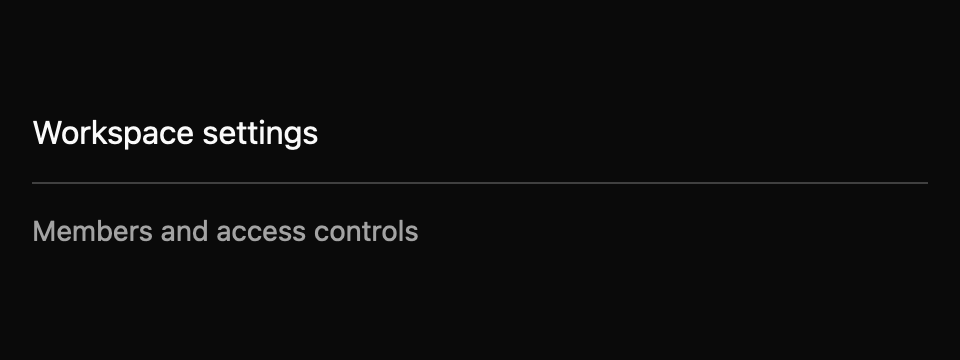

# Separator

> **Draft everyday component.** Its public API, accessibility contract, and visual baselines still need maintainer review. It is not marked `source_ready` for `cargo mkit add`.

A separator is a quiet line between groups of content. It does not respond to clicks or keys.

## When to use it

- Divide toolbar groups.
- Separate sections of a settings page.
- Add a vertical rule between two columns.

## Preview

This is a checked-in dark-theme, 2× screenshot baseline of one state. The component spec lists the other captured states, themes, and scales.

## API and state

`orientation`, `decorative`, and optional `label` (an accessible name only); no events. This is a stateless `RenderOnce` builder.

## Keyboard and pointer behavior

| Key | Behavior |
| --- | --- |
| None | The line is not focusable or interactive. |

No keyboard behavior or key context is needed. The separator is not interactive.

None.

## Accessibility

Decorative separators do not set an accessibility role. Semantic separators request AccessKit's `Splitter` role and set orientation; `label`, when supplied, becomes the accessible name. The pinned AccessKit version does not expose a noninteractive separator role, so `Splitter` is the closest available role and can imply resizability on some platforms. This mismatch needs maintainer review before treating the role as a final public contract.

## Theme

`Theme.colors.border` provides the line color and `Theme.borders.hairline` provides its thickness. No colors or dimensions are hard-coded.

## Verification and limits

The registry crate check and test commands pass, and the dedicated screenshot test passes 12/12 horizontal/vertical comparisons across three themes and two scales. There is no focused interaction test: the separator is not focusable or interactive by design.

The semantic variant maps to AccessKit Splitter, which can imply a resizable divider; that role needs maintainer review before it becomes the final public contract, and decorative remains the default. Active-platform interpretation of the role is open.

For the exact state and event contract, see the checked-in `registry/separator/spec.md`. The [everyday components overview](../everyday-components.md) tracks current test evidence.
