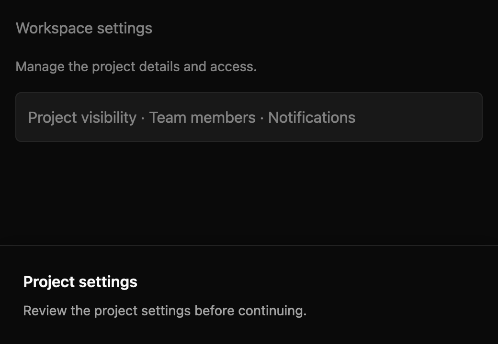

# Sheet

> **Draft everyday component.** Its public API, accessibility contract, and visual baselines still need maintainer review. It is not marked `source_ready` for `cargo mkit add`.

A sheet is a modal panel that enters from the bottom of the host viewport. It gives a longer workflow more room while blocking interaction behind it.

## When to use it

- Edit account settings in a bottom panel.
- Review several options before submitting a form.
- Show a compact workflow on a narrow window.

## Preview

This is a checked-in dark-theme, 2× screenshot baseline of one state. The component spec lists the other captured states, themes, and scales.

## API and state

`set_open` applies a supplied boolean; `is_open` reads it. In uncontrolled mode, Escape closes the surface and emits `OpenChanged(false)`. In controlled mode, Escape emits the same request but leaves `open` unchanged until `set_open`. The title and string content are fixed at construction. `with_content` accepts an element factory for interactive content, and `focus_stops` supplies that content's focus handles in visual order. The caller must track those handles on the corresponding controls.

The caller supplies interactive content and its focus handles when using `with_content`; string-only content needs no extra focus stops.

## Keyboard and pointer behavior

| Key | Behavior |
| --- | --- |
| Escape | Request dismissal unless busy. |
| Tab | Move to the next supplied focus stop, wrapping inside the sheet. |
| Shift+Tab | Move to the previous focus stop, wrapping inside the sheet. |

`Sheet` key context binds Escape to `Dismiss`, Tab to `FocusForward`, and Shift+Tab to `FocusBackward`. Actions are rebindable. Escape has no effect when closed or busy. With string content, Tab wraps on the root focus handle. With caller-built content, Tab wraps across the supplied focus handles in visual order, starting on the first stop at open.

The open backdrop fills the available host viewport. Pointer down outside the panel requests dismissal unless busy, and is consumed by the backdrop so host controls cannot receive the press. The panel is bottom aligned in that host-provided viewport; callers should mount the sheet at the window content root for viewport placement.

## Accessibility

The open panel exposes AccessKit `dialog` role with the supplied title as its accessible name. While busy, a visible child exposes AccessKit `status` role, the name `Work in progress`, and the text `Dismissal is paused until this work finishes.` The root receives initial focus for string content; the first supplied focus stop receives initial focus for caller-built content. Tab is trapped within the content stops, and the previously focused handle is restored on close when it remains alive. Backdrop blocks host pointer interaction. Closed root has no `dialog` role. An active-platform snapshot must verify the name and focus relationship.

## Theme

Sheet follows shadcn/ui's bottom sheet: a 50% near-black backdrop and a full-width panel with the `background` fill, square corners, a hairline border on its top edge, a large shadow, and 24px padding. The title is semibold and string content is muted description text. In dark themes the hairline is text at 10% opacity. The busy status uses a muted fill. The high-contrast theme uses a solid background panel with a `border` top edge. Colours, spacing, shadows, and typography come from theme tokens; the spec's theme table lists each mapping.

## Current limits

Mount at the window content root. For interactive content, keep focus stops synchronized with rendered controls. Focus stops are fixed when you create the sheet, so a control that appears only in some states, such as Stepper's Back button, can't be one of them. For a multi-step flow inside a sheet, see [Stepper](stepper.md#inside-a-dialog-or-sheet).

For the exact state and event contract, see the checked-in `registry/sheet/spec.md`. The [everyday components overview](../everyday-components.md) tracks current test evidence; these pages are documentation drafts, not a claim that the full conformance matrix has passed.
