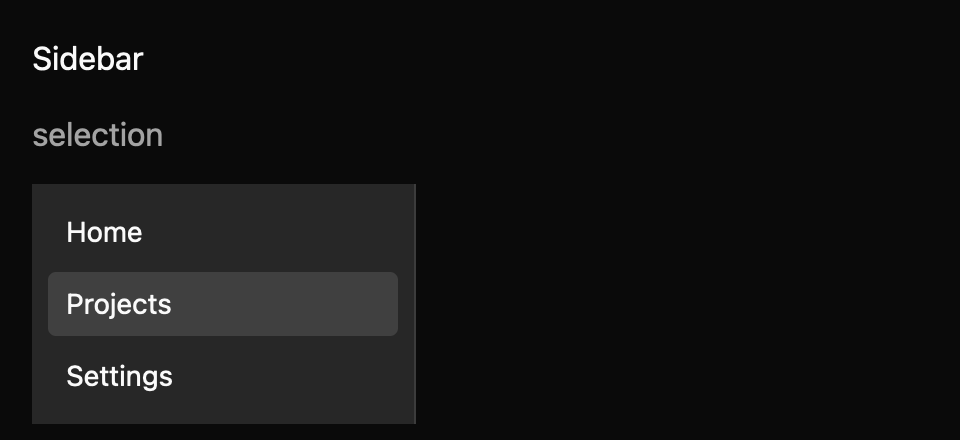

# Sidebar

> **Draft everyday component.** Its public API, accessibility contract, and visual baselines still need maintainer review. It is not marked `source_ready` for `cargo mkit add`.

A sidebar groups destinations in a labelled navigation area. The app owns the destination and route change after a link is activated.

## When to use it

- Move between Home, Projects, and Settings.
- Show which workspace section is currently open.
- Disable a destination that is unavailable for this user.

## Preview

This is a checked-in dark-theme, 2× screenshot baseline of one state. The component spec lists the other captured states, themes, and scales.

## API and state

The builder accepts an accessible label, items, current/default value, orientation, and disabled state. `SelectionChanged(Option<String>)` requests a current-page value when an enabled link is activated. Uncontrolled mode applies the request. Controlled mode emits the request without changing its current value until the owner calls `set_value`.

## Keyboard and pointer behavior

| Key | Behavior |
| --- | --- |
| Tab / Shift+Tab | Move through enabled links in normal page order. |
| Enter | Request navigation to the focused link. |
| Arrow keys | No special sidebar binding. |

Each enabled link participates in normal Tab order. Enter activates the focused link. Disabled links are excluded from Tab order and ignore pointer and keyboard activation. The component does not add arrow-key navigation to a navigation landmark.

Click an enabled link to request navigation using the same event contract as Enter. Disabled links and a disabled container ignore clicks.

## Accessibility

Navigation landmark with accessible label, containing links with accessible names. The current enabled link has a “Current page” description; GPUI does not expose AccessKit `aria-current` for this element yet. Disabled links are described as unavailable and are not keyboard focusable.

## Theme

Theme background, surface, text, border, accent, accent text, focus, disabled; spacing, borders, radii, controls, typography tokens.

The sidebar is a flat pane with a muted background and a hairline divider on its trailing edge. Items are borderless 32px rows (`controls.small`) with `radii.small` corners. Hover and the current page use an accent fill, and the current page also uses medium font weight. In the shadcn themes those fills mix `text` into `background`. In high contrast, the current page keeps the solid accent fill and hover shows a border. Keyboard focus always draws the item border in the `focus` colour. The owner sets the pane width. The spec records the exact token mapping. A visible group label and leading item icons are proposals that need API decisions.

## Verification and limits

The generated Enter case passes 1/1 through a real GPUI adapter, and focused tests cover controlled, uncontrolled, and disabled behavior plus pointer activation. The screenshot matrix passes 12/12 selection/disabled comparisons across three themes and two scales; the selection fixture visibly selects Projects after a real click.

Native current-page and URL properties are not yet exposed by this GPUI bridge. The generated accessibility cases are pending because the headless test platform does not activate the accessibility tree. The full conformance matrix and maintainer API, spec, and visual review are outstanding.

For the exact state and event contract, see the checked-in `registry/sidebar/spec.md`. The [everyday components overview](../everyday-components.md) tracks current test evidence.
