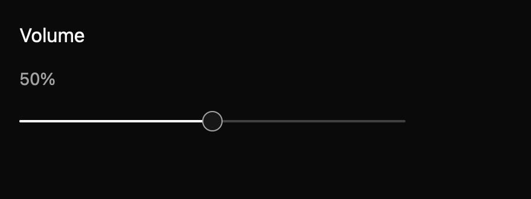

# Slider

Choose a bounded number or ordered range with one or two thumbs. This E7 component is a draft with an `implementation_in_progress` registry entry. Its public contract needs maintainer review.

*Dark theme, 2× baseline capture: `middle` state.*

## API and state

`Slider::new(label, value, min, max, step)` owns one value; `range` owns two endpoints. `controlled` emits a complete `ChangeRequested(Vec<f64>)` while retaining the displayed values until `set_value(values, cx)`. `values()` reads them. Disabled suppresses input.

Each changed keyboard action emits `InteractionStarted`, `ChangeRequested`, then `InteractionEnded`; no-op keyboard actions emit nothing. A pointer gesture emits `InteractionStarted` on press, changes only when the target changes, and ends on release. Escape cancels an active pointer gesture and emits `InteractionCancelled` with the original value vector. Uncontrolled mode restores its own original values; controlled owners restore through `set_value`. Lifecycle payloads contain full value vectors, including for range sliders.

## Keyboard behavior

The component's named actions can be rebound by the host where applicable.

| Key or action | Current behavior |
| --- | --- |
| Arrows | Increase or decrease the focused thumb. |
| Page Up/Down | Take a larger step. |
| Home, End | Move to allowed minimum or maximum. |
| Shift/Alt adjustments | Use registered fine or micro step actions. |

## Accessibility

Each thumb requests a slider role and min/max/current value. A range names thumbs “minimum” and “maximum”; each has its own Tab stop. Disabled thumbs leave Tab order. Endpoint crossing is prevented. Platform value announcements are pending.

## Theme tokens

Theme track/fill/thumb/focus/disabled colors; controls and borders size the track/thumb; radii.pill. The 0.6 × xsmall thumb ratio awaits maintainer review.

## Usage scenarios

- Set audio volume from a bounded percentage.
- Choose a price interval with two independent range thumbs.
- Set a controlled threshold and apply the emitted vector after validation.

## Verification and limits

6 generated keyboard cases cover value changes. Seven package tests pass, including GPUI assertions for keyboard start/change/end ordering, pointer end ordering, and controlled and uncontrolled Escape cancellation. The existing 30/30 screenshot comparisons passed before this lifecycle API change; interactive screenshots of the new gesture states remain pending. These are focused draft checks, not release approval. The full E5 conformance matrix and maintainer review are outstanding. The current contract and evidence are in `registry/slider/spec.md` and `docs/E7_AUDIT.md` in the repository.
