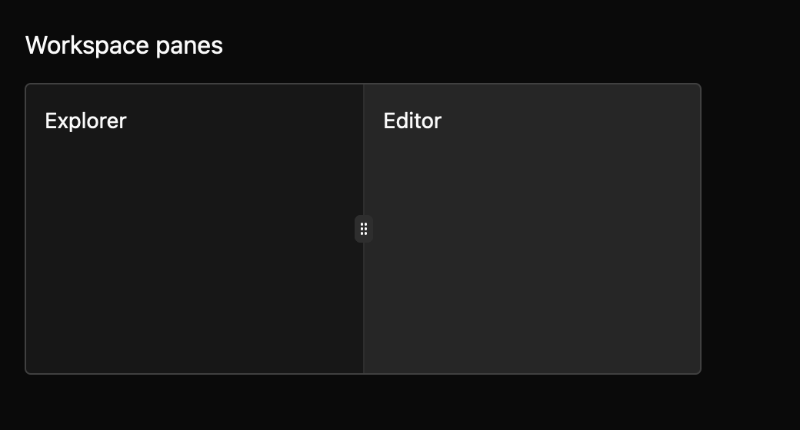

# Split pane

> **Draft everyday component.** Its public API, accessibility contract, and visual baselines still need maintainer review. It is not marked `source_ready` for `cargo mkit add`.

A split pane gives two panels a draggable divider so someone can decide how much room each gets.

## When to use it

- Resize a file explorer beside an editor.
- Balance preview and source panels.
- Give a timeline more height below a canvas.

## Preview

This is a checked-in dark-theme, 2× screenshot baseline of one state. The component spec lists the other captured states, themes, and scales.

## API and state

`ratio` or `default_ratio`, `min_ratio`, `max_ratio`, `orientation`, `disabled`; typed `RatioChanged(f32)` event. Controlled mode emits a requested ratio and waits for `set_ratio`; uncontrolled mode updates itself. `set_ratio` emits no event.
Default bounds are 10–90% of the available space, keeping both panes reachable.

## Keyboard and pointer behavior

| Key | Behavior |
| --- | --- |
| Left / Right | Resize a horizontal split by 2% per press. |
| Up / Down | Resize a vertical split by 2% per press. |
| Shift + direction | Resize by a fine 0.5% step. |
| Home / End | Move the divider to its configured minimum or maximum. |
| Tab | Reach an enabled divider in normal focus order. |

Horizontal: Left/Right; vertical: Up/Down. Home/End go to bounds, Shift modifies step. `MkitSplitPane` context exposes named resize actions.
Normal adjustment is 2% of the viewport; Shift adjustment is 0.5%.
Tab reaches the enabled divider in normal focus order; disabled dividers are omitted. Keyboard focus exposes the focus token on the divider.

Dragging the divider adjusts the ratio within bounds; releasing ends the drag. Disabled blocks drag.
The root and divider expose stable `mkit-split-pane` and `mkit-split-pane-divider` GPUI debug selectors for pointer harness scripts.

## Accessibility

The divider exposes splitter role, name, orientation, current value, and bounds; children preserve their own semantics.

## Theme

`Theme.colors.background/border/text/focus/disabled`, `Theme.borders.hairline`, `Theme.spacing.xsmall/medium/large`, `Theme.radii.small`.

The handle follows the shadcn/ui resizable handle: a 1px line in the border colour with a small 12×18px grip showing six vector dots. A transparent 4px pointer target is centred on the line. Keyboard focus colours the line and grip border with `focus` and adds a 3px ring around the grip. Disabled handles mix every colour 50% into the background, and high contrast keeps white lines and a solid `disabled` colour. The grip is always shown; hiding it would need a new builder. The spec records the exact token mapping.

## Verification and limits

Ten generated keyboard cases pass through a real GPUI adapter, covering horizontal and vertical arrows, Shift fine steps, and Home/End with exact-ratio and single-event assertions; a focused keyboard/pointer resize test and package Clippy pass alongside them. The screenshot matrix passes 30/30 centered/resized/vertical-centered/focused/disabled comparisons across three themes and two scales; representative centered, focused, disabled, and vertical captures were inspected.

Pointer capture beyond the application window still needs review. Five declared accessibility cases are pending, and the generated accessibility cases cannot pass on the headless test platform because it does not activate the accessibility tree. Active-platform accessibility and maintainer API, spec, and visual review are outstanding.

For the exact state and event contract, see the checked-in `registry/split-pane/spec.md`. The [everyday components overview](../everyday-components.md) tracks current test evidence.
