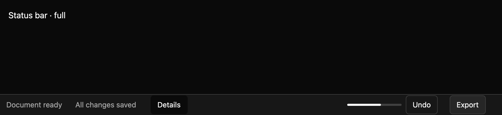

# Status bar

A status bar shows concise state and quick controls along the bottom edge of a window. Status text
uses polite live-region semantics. It does not steal focus when its message changes.

*Dark theme, 2× baseline capture: `full` state.*

## Layout and collapse

Build leading and trailing regions from status text, supplied buttons, and determinate or
indeterminate progress items. At narrow widths, lower-priority items collapse first; mark essential
content and controls `Never` to keep them visible. The host supplies the available logical width, and
custom element items can provide an estimated width. If never-collapse items exceed the width, this
draft clips them rather than opening an overflow menu.

## Focus and ownership

Each supplied button keeps its own accessible name, disabled state, pointer action, and normal
keyboard activation. Tab order follows enabled controls from the leading through trailing region.
The application owns message text, progress values, and button actions; there is no internal state or
controlled/uncontrolled event contract.

The gallery matrix compares five states in three themes and two scales. Native accessibility
snapshots and screen-reader announcement timing remain pending, and the width-estimation API needs
maintainer review. See `docs/E7_STATUS_BAR.md` and the source contract in
`registry/status-bar/spec.md` in the repository.
