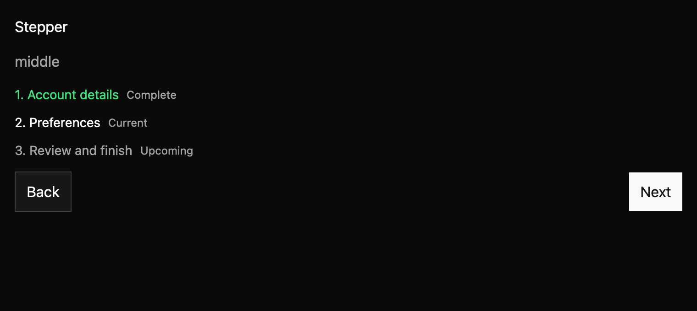

# Stepper

Stepper provides labeled progress and navigation for a multi-step flow. Your app owns each step's
content and decides when to place the flow inside a dialog or sheet.

The API draft starts with `Stepper::new(label, steps)`. Use `.default_step(index)` for internal
navigation or `.current_step(index)` when the parent owns the active index. Forward navigation may
use a synchronous validator. On failure the component keeps the current step active and announces a
polite error. Back, Next, and Finish emit typed navigation proposals.

Keyboard activation uses Enter and Space on the focused navigation button. Alt+Left and Alt+Right
are registered in the Stepper key context for app-level rebinding. The progress header is
informational; it is not a tablist. Inside Dialog or Sheet, the container remains responsible for
focus trapping and dismissal.

Review the draft contract in `registry/stepper/spec.md` and evidence in `docs/E7_STEPPER.md`.
