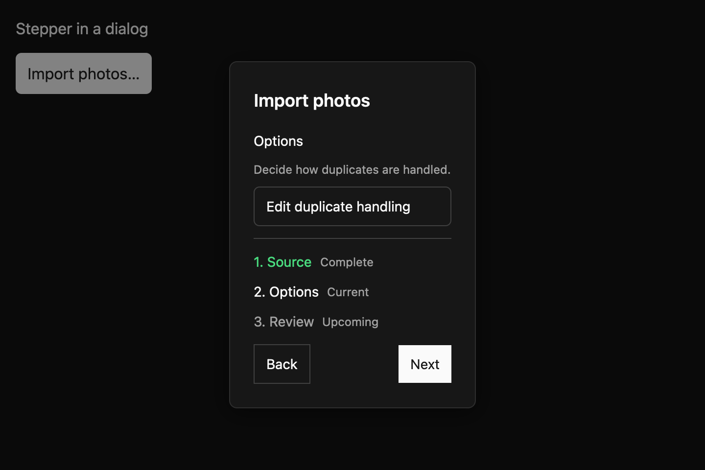
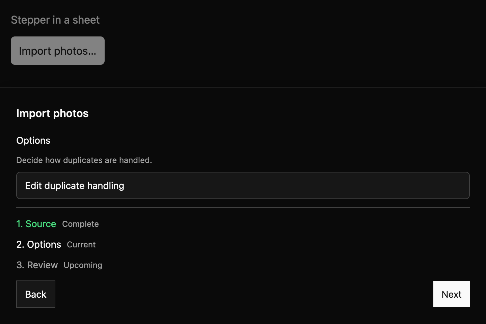

# Stepper

Stepper provides labeled progress and navigation for a multi-step flow. Your app owns each step's
content and decides when to place the flow inside a dialog or sheet.


The API draft starts with `Stepper::new(label, steps)`. Use `.default_step(index)` for internal
navigation or `.current_step(index)` when the parent owns the active index. Forward navigation may
use a synchronous validator. On failure the component keeps the current step active and announces a
polite error. Back, Next, and Finish emit typed navigation proposals.

Keyboard activation uses Enter and Space on the focused navigation button. Alt+Left and Alt+Right
are registered in the Stepper key context for app-level rebinding, and they work from either
navigation button. The progress header is
informational; it is not a tablist. Inside Dialog or Sheet, the container remains responsible for
focus trapping and dismissal.

## Inside a dialog or sheet

Your app owns the composition: create the stepper and the step content, then pass both to
`Dialog::with_content` or `Sheet::with_content`. The runnable scene lives in the
`examples/e7_compositions` crate, so registry components never depend on each other.

The step content reads the stepper's current index each time it renders:

```rust
{{#include ../../../../examples/e7_compositions/src/lib.rs:stepper_modal_step_content}}
```

The host builds the stepper, the content, and the container, then decides what Finish means:

```rust
{{#include ../../../../examples/e7_compositions/src/lib.rs:stepper_modal_compose}}
```





- **Focus stays in the container.** In a dialog, Tab and Shift+Tab follow rendered order across
  the dialog surface, the step content, Back, and Next or Finish. A sheet traps Tab among the
  focus stops you pass when you create it. Back appears only after the first step, so it can't be
  one of those fixed stops. Users reach it with Alt+Left or the pointer, and Tab from Back returns
  to the stop list.
- **Escape belongs to the container.** Stepper binds no Escape action, so Escape dismisses the
  dialog or sheet from any stepper button or step content. The container emits
  `OpenChanged(false)`; the stepper emits nothing.
- **Your app owns the step.** Dismissing the container doesn't reset the stepper. When the user
  reopens it, they're on the same step unless you call `set_current_step`. In this scene, Finish
  closes the container and starts the flow again at the first step.

Review the draft contract in `registry/stepper/spec.md` and evidence in `docs/E7_STEPPER.md`.
