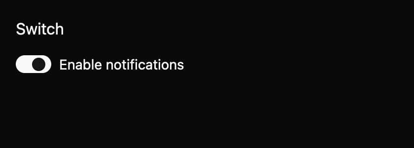

# Switch

Turn a setting on or off immediately. This E7 component is a draft with an `implementation_in_progress` registry entry. Its public contract needs maintainer review.

*Dark theme, 2× baseline capture: `on` state.*

## API and state

`Switch::new(label, default_checked)` owns state. `controlled(label, checked)` emits `ChangeRequested(bool)` and waits for `set_checked`; uncontrolled activation updates and emits. Disabled suppresses requests.

## Keyboard behavior

The component's named actions can be rebound by the host where applicable.

| Key or action | Current behavior |
| --- | --- |
| Space | Toggle the focused enabled switch. |
| Enter | No default activation binding. |

## Accessibility

Requests switch role, stable name, and checked state. Disabled leaves Tab order and requests disabled state with an unavailable description. The accessible name should not encode on/off. Native announcements remain unverified.

## Theme tokens

Global surface, text, border, accent, focus, disabled; spacing.xsmall/small, radii.pill, border.hairline, typography.body.

## Usage scenarios

- Turn automatic updates on or off.
- Enable dark appearance as an immediate preference.
- Control a remotely managed feature flag by applying accepted change requests.

## Verification and limits

Space adapter passed. 18/18 screenshot comparisons passed; active-platform accessibility remains open. These are focused draft checks, not release approval. The full E5 conformance matrix and maintainer review are outstanding. The current contract and evidence are in `registry/switch/spec.md` and `docs/E7_AUDIT.md` in the repository.
