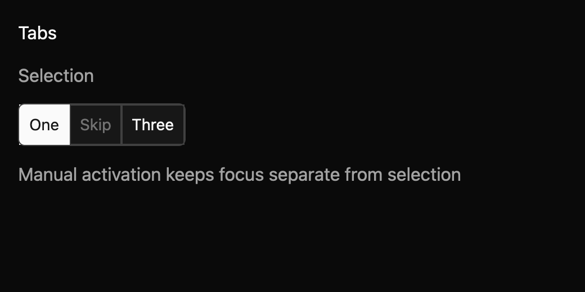

# Tabs

> **Draft E7 component.** Its public API, accessibility contract, and visual baselines still need maintainer review. It is not marked `source_ready` for `cargo mkit add`.

Tabs switch among related panels within one part of a screen. Moving keyboard focus does not change the selected panel until the person activates a tab.

## When to use it

- Switch between Overview, Activity, and Settings panels.
- Keep an editor’s Preview and Source views in one space.
- Show separate results categories without changing routes.

## Preview

This is a checked-in dark-theme, 2× screenshot baseline of one state. The component spec lists the other captured states, themes, and scales.

## API and state

Label, items, selected/default value, disabled state, and orientation. `ValueChanged(Option<String>)` fires when the focused tab is activated or an enabled tab is clicked; in controlled mode this is a proposal and the displayed selection changes only after `set_value`.

## Keyboard and pointer behavior

| Key | Behavior |
| --- | --- |
| Left / Right or Up / Down | Move focus among enabled tabs on the configured axis, with wrapping; do not select. |
| Home / End | Focus the first or last enabled tab without selecting. |
| Enter / Space | Request selection of the focused tab. |

Left/Right (horizontal) or Up/Down (vertical) moves focus among enabled tabs with wrapping. Home/End move focus to enabled endpoints. Enter/Space activates the focused tab. Actions are registered in `MkitTabs`; orthogonal arrow keys do nothing.

Click an enabled tab to focus and request its selection. Clicking a disabled tab has no effect.

## Accessibility

Tablist with accessible label and orientation; each item is Tab with selected state. Only the focused enabled tab is in the tab sequence; disabled tabs cannot receive focus or activate and are described as unavailable. Panels and `aria-controls` relationships are owned by the application.

## Theme

Theme surface, text, muted text, border, accent, accent text, focus, disabled; spacing, borders, radii, controls, typography tokens.

## Verification and limits

Nine generated keyboard cases pass through a real GPUI adapter, covering arrow movement with wrapping, Home and End, and Enter/Space activation; three package tests pass alongside them. The screenshot matrix passes 36/36 comparisons across six states, three themes, and two scales.

The app owns panel content and its relationship to each tab; active-platform panel relationships need verification. The generated accessibility cases are pending because the headless GPUI test platform does not activate the accessibility tree. The full E5 conformance matrix and maintainer API, spec, and visual review are outstanding.

For the exact state and event contract, see the checked-in `registry/tabs/spec.md`. The [E7 overview](../everyday-components.md) tracks current test evidence.
