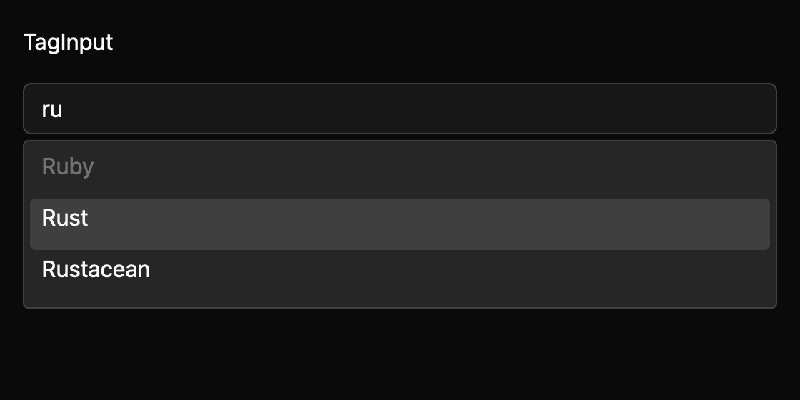

# Tag input

TagInput collects labels, recipients, and filters as a list of removable chips with one shared text editor. Enter or comma commits a trimmed value; Backspace selects the last tag and a second press removes it. Arrow keys move a virtual selection while focus stays in the editor. Optional suggestions use Combobox-style filtering and active-option behavior, while disabled suggestions remain visible but cannot be activated.

Uncontrolled mode applies changes locally and emits the full new list. Controlled mode emits the same proposal and waits for the owner to call `set_tags`. Per-tag validation messages stay attached to each tag. Duplicate and maximum-count candidates are rejected with typed events and status text.

The editor uses TextField for native selection, clipboard, Unicode, and IME behavior. This documented dependency exception and the TagInput API are drafts pending maintainer review. Accessibility snapshots and native announcement behavior need active-platform validation. The component specification is maintained in `registry/tag-input/spec.md`.

