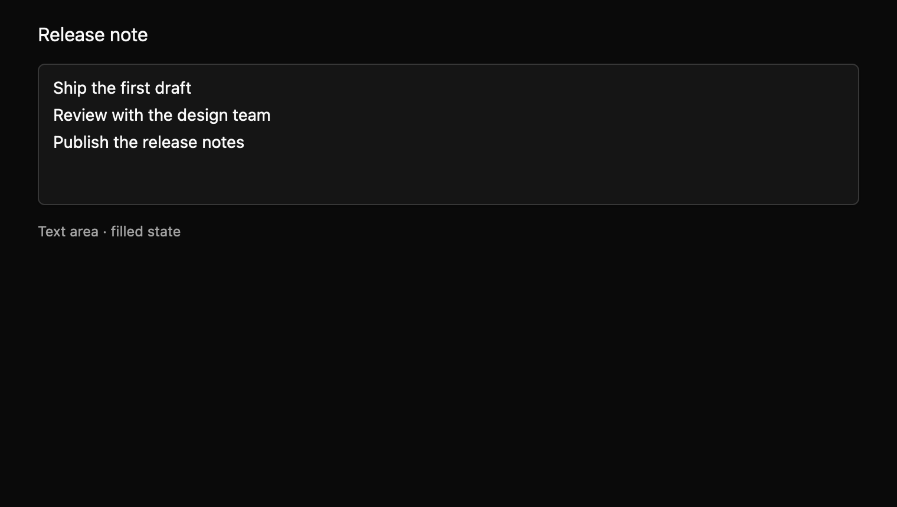

# Text area

Edit multiline text with wrapping and vertical caret scrolling. This everyday component is a draft with an `implementation_in_progress` registry entry. Its public contract needs maintainer review.

*Dark theme, 2× baseline capture: `filled` state.*

## API and state

Create an `Entity<TextArea>` with `TextArea::new(cx)`; builders set label, placeholder, description, validation message, and disabled. `controlled(value)` starts owner-managed mode. User edits update the local buffer immediately and emit one full-text `InputChanged(String)` snapshot. `set_value(value, cx)` accepts or replaces it without an event; equal echoes preserve selection, marked text, and undo grouping, while differing values reset editing history.

## Keyboard behavior

The component's named actions can be rebound by the host where applicable.

| Key or action | Current behavior |
| --- | --- |
| Enter | Insert a newline. |
| Command/Control+A/C/X/V | Select all, copy, cut, or paste. |
| Command/Control+Z, Shift+Z | Undo or redo. |
| Tab | Use normal focus traversal. |

## Accessibility

Requests MultilineTextInput role, label, current text value, description or validation message, invalid and disabled state. Placeholder is not the value. A scoped macOS gallery check saw a native text area, but generated accessibility cases remain pending.

## Theme tokens

Text areas use the same look as text fields: a one-pixel input border, `radii.medium` corners, a small shadow, 14px text (`typography.body`), 12px by 8px padding, a focus-coloured border and 3px ring on focus, and a danger border and faint danger ring when invalid. Disabled areas render at 50% strength, and high contrast keeps solid borders and a solid focus ring. The editor keeps a fixed 120px height (`controls.large` × 3) and scrolls. The fixed 12px hit-test inset still needs review. The spec's theme table lists each token mapping.

## Usage scenarios

- Write release notes across several paragraphs.
- Edit a support message with validation feedback.
- Use controlled notes where the parent stores the accepted text and echoes it back.

## Verification and limits

8/8 generated keyboard cases, 10/10 registry tests, and 42/42 screenshot comparisons passed. Live native IME placement and full accessibility contract remain open. These are focused draft checks, not release approval. The full conformance matrix and maintainer review are outstanding. The current contract and evidence are in `registry/text-area/spec.md` and `docs/E7_AUDIT.md` in the repository.
