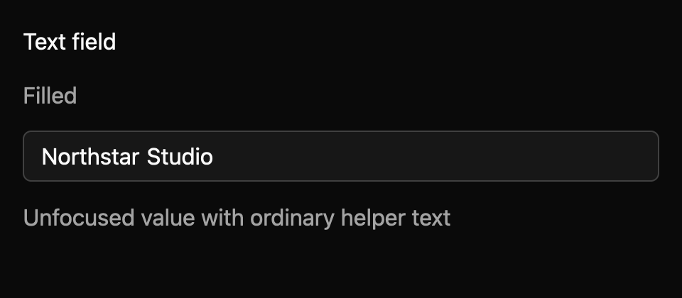

# Text field

Edit a short, single-line value. This E7 component is a draft with an `implementation_in_progress` registry entry. Its public contract needs maintainer review.

*Dark theme, 2× baseline capture: `filled` state.*

## API and state

Create an `Entity<TextField>` with `TextField::new(cx)`; builders set label, placeholder, description, validation message, disabled, and secure presentation. `controlled(value)` starts owner-managed mode. User edits update the local buffer immediately and emit one full-text `InputChanged(String)` snapshot. Owner calls `set_value(value, cx)` to accept or replace it; programmatic updates emit nothing. Equal echoes preserve selection, IME marked text, and undo history; differing values reset editing history.

## Keyboard behavior

The component's named actions can be rebound by the host where applicable.

| Key or action | Current behavior |
| --- | --- |
| Command/Control+A | Select all. |
| Command/Control+C/X/V | Copy, cut, or paste plain text; paste normalizes line breaks to spaces. |
| Command/Control+Z, Shift+Z | Undo or redo. |
| Tab | Use normal focus traversal. |

## Accessibility

Requests TextInput role, label, current text value, description or validation message, invalid and disabled state as applicable. `secure(true)` masks the display and accessible value, requests PasswordInput, and disables Copy and Cut; callers still receive the clear value in `InputChanged`. Placeholder is not the accessible value. Generated accessibility cases are pending despite a scoped macOS gallery inspection.

## Theme tokens

Global surface/text/muted/border/focus/danger/accent colors; spacing.xsmall/medium, controls.medium, radii.medium, borders.strong, typography.heading. The fixed hit-test inset needs review.

## Usage scenarios

- Collect a workspace name in a settings form.
- Edit an email subject with validation feedback.
- Bind a controlled short search query to an owner that may normalize the text.

## Verification and limits

The 6/6 generated keyboard cases, 9/9 registry tests, and 36/36 screenshot comparisons pass, including the six secure-state captures. A unit check covers Unicode masking. Active-platform per-state accessibility, native IME placement, and the full accessibility contract remain open. These are focused draft checks, not release approval. The full E5 conformance matrix and maintainer review are outstanding. The current contract and evidence are in `registry/text-field/spec.md` and `docs/E7_AUDIT.md` in the repository.
