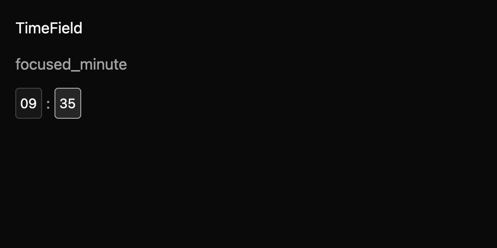

# TimeField

TimeField edits a civil time as focused hour, minute, optional second, and AM/PM segments. The
stored `TimeValue` is always 24-hour time; apps choose 12- or 24-hour display and supply localized
segment names, period labels, and separators.

Arrow Up/Down adjust the focused segment. Shift+Arrow adjusts by five times the configured step.
Left/Right move between visible segments; digits replace numeric segments, and Enter commits a
complete draft. Minimum and maximum times constrain edits. Controlled mode emits a change request
without replacing the owner's value; uncontrolled mode commits and emits a change event.

The registry draft is `registry/time-field/spec.md`. Seven GPUI interaction tests cover adjustment,
typed values, controlled requests, bounds, 12-hour periods, optional seconds, and disabled input.
The macOS screenshot matrix covers seven states across three themes and two scales. Native
accessibility tree snapshots remain pending, and maintainers must review the public API.
