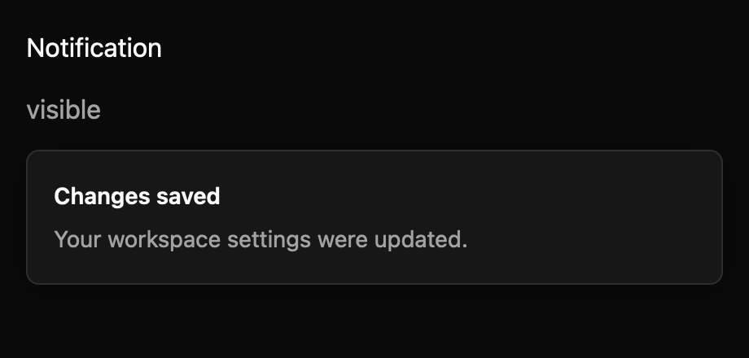

# Toast

> **Draft everyday component.** Its public API, accessibility contract, and visual baselines still need maintainer review. It is not marked `source_ready` for `cargo mkit add`.

A toast gives short feedback after an action, such as a successful save. The app chooses where it appears in the window.

## When to use it

- Confirm that settings were saved.
- Report that a background sync started or finished.
- Announce an urgent failure with the alert variant.

## Preview

This is a checked-in dark-theme, 2× screenshot baseline of one state. The component spec lists the other captured states, themes, and scales.

## API and state

`set_open` applies a supplied boolean; `is_open` reads it. `set_busy` updates suppression and restarts the timeout when leaving busy state. In uncontrolled mode, Escape closes the surface and emits `OpenChanged(false)`. In controlled mode, Escape emits the same request but leaves `open` unchanged until `set_open`. The title and content are strings fixed at construction.

## Keyboard and pointer behavior

| Key | Behavior |
| --- | --- |
| Escape | Request dismissal while open, unless busy. |
| Other keys | No component binding; the host owns focus and surrounding controls. |

`Toast` key context binds Escape to `Dismiss`. The action is rebindable. It has no effect when closed or busy. A five-second timer requests dismissal. No Enter, Space, Tab, or focus-loop action is implemented.

The surface has no pointer handlers, close button, trigger, outside-click dismissal, or positioning logic. The host must provide any of these behaviors.

## Accessibility

The open root exposes AccessKit `status` role with polite live-region priority by default, or `alert` role with assertive priority when `alert(true)` is set. Its accessible name includes the title and content; it tracks a focus handle for Escape. Closed root has no live-region role. Actual assistive-technology announcements still need an active-platform check.

## Theme

Toast follows the shadcn/ui look: the `surface` colour with a hairline border, large radius, large shadow, and 16px padding. The title is semibold and the content is muted. In dark themes the hairline is text at 10% opacity. The high-contrast theme uses a solid background with a `border` outline. Colours, radii, spacing, shadows, and typography come from theme tokens; the spec's theme table lists each mapping.

## Current limits

The five-second timeout is fixed. Placement, a close button, and pointer dismissal are host responsibilities; platform live-region announcements remain unverified.

For the exact state and event contract, see the checked-in `registry/toast/spec.md`. The [everyday components overview](../everyday-components.md) tracks current test evidence; these pages are documentation drafts, not a claim that the full conformance matrix has passed.
