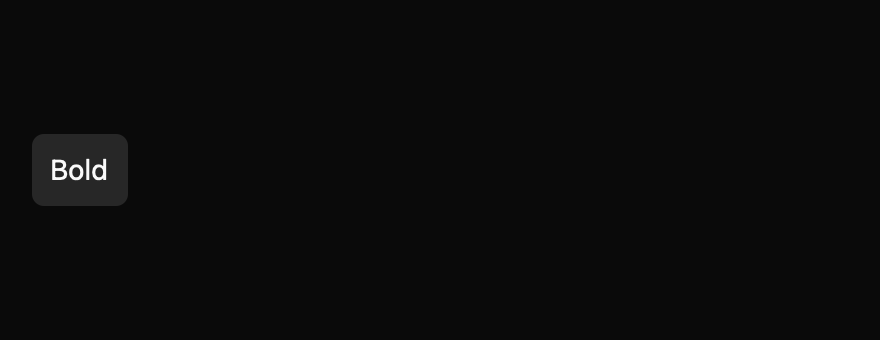

# Toggle button

Keep one persistent pressed or unpressed choice. This everyday component is a draft with an `implementation_in_progress` registry entry. Its public contract needs maintainer review.

*Dark theme, 2× baseline capture: `on` state.*

## API and state

`ToggleButton::new(label, default_pressed)` owns its value. `controlled(label, pressed)` emits `ValueChanged(bool)` requests without changing displayed state; the owner applies `set_pressed`. Uncontrolled activation updates state before emitting. Disabled activation is inert.

## Keyboard behavior

The component's named actions can be rebound by the host where applicable.

| Key or action | Current behavior |
| --- | --- |
| Enter, Space | Request the opposite pressed value when enabled. |

## Accessibility

Requests button role, accessible name, and pressed state. Disabled leaves Tab order and requests disabled state with an unavailable description. Platform pressed-state announcements remain unverified.

## Theme tokens

Toggle buttons follow the shadcn/ui toggle. They are transparent when off, show a muted hover fill, and use a muted accent fill with regular text when pressed. They are 36px tall (`controls.medium`) with 8px padding, `radii.medium` corners, and 14px medium-weight labels. Disabled toggles render at 50% opacity, and keyboard focus adds a focus-coloured border and a 3px ring. The high-contrast theme uses a white border when off, a solid accent fill when pressed, and the `disabled` colour when unavailable. The spec's theme table lists each token mapping.

## Usage scenarios

- Make a Bold formatting control that remains pressed while bold is active.
- Pin a side panel open until the user toggles it again.
- Let an owner control a Preview mode and apply accepted `ValueChanged` requests.

## Verification and limits

Enter/Space adapter and focused controlled, uncontrolled, and disabled tests passed. 18/18 declared screenshot comparisons passed. These are focused draft checks, not release approval. The full conformance matrix and maintainer review are outstanding. The current contract and evidence are in `registry/toggle-button/spec.md` and `docs/E7_AUDIT.md` in the repository.
