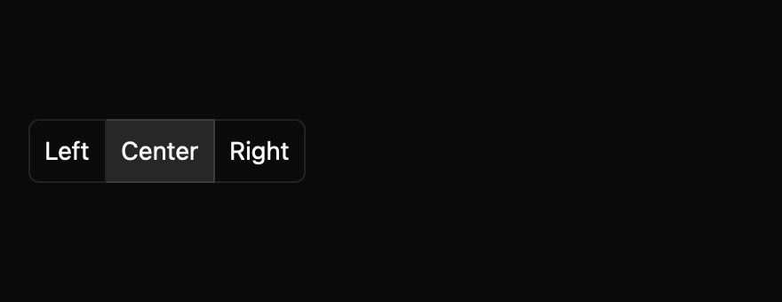

# Toggle group

Choose at most one pressed item from a related set. This everyday component is a draft with an `implementation_in_progress` registry entry. Its public contract needs maintainer review.

*Dark theme, 2× baseline capture: `selection` state.*

## API and state

`ToggleGroup::new(label, items, default_value)` owns selection. `controlled(...)` emits `ValueChanged(Option<String>)` requests and waits for `set_value`. `allow_empty` permits clearing selection; orientation may be horizontal or vertical. Disabled items are skipped.

## Keyboard behavior

The component's named actions can be rebound by the host where applicable.

| Key or action | Current behavior |
| --- | --- |
| Orientation arrows | Move focus and select the next enabled item, wrapping; cross-axis arrows do nothing. |
| Home, End | Focus and select the first or last enabled item. |

## Accessibility

Requests a labelled group of button-role items with pressed state. One enabled item is in Tab order. Disabled group/items request disabled state; disabled items have an unavailable description. Platform announcements remain unverified.

## Theme tokens

Toggle groups follow shadcn/ui's outline toggle group. Items are joined, with shared borders and rounded outer corners only. The group has a small shadow. The selected item uses a muted accent fill, and unselected items show a muted hover fill. Items are 36px tall (`controls.medium`) with 14px medium-weight labels. Disabled items or groups render at 50% opacity, and keyboard focus adds a focus-coloured border and a 3px ring. The high-contrast theme keeps white borders and a solid accent selection. The spec's theme table lists each token mapping.

## Usage scenarios

- Choose Left, Center, or Right text alignment.
- Choose one canvas view mode, with vertical orientation in a side rail.
- Use controlled selection for a filter toolbar whose state lives in the parent.

## Verification and limits

Six generated keyboard cases passed, including cross-axis no-op and controlled requests. 12/12 declared screenshots matched. These are focused draft checks, not release approval. The full conformance matrix and maintainer review are outstanding. The current contract and evidence are in `registry/toggle-group/spec.md` and `docs/E7_AUDIT.md` in the repository.
